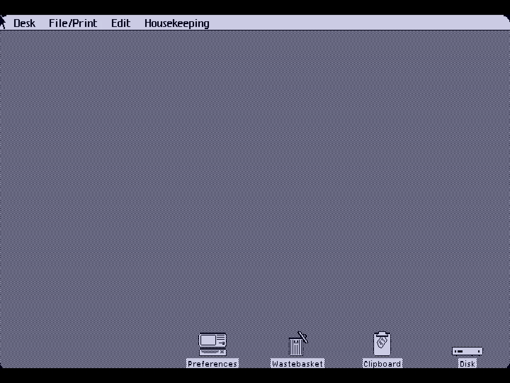
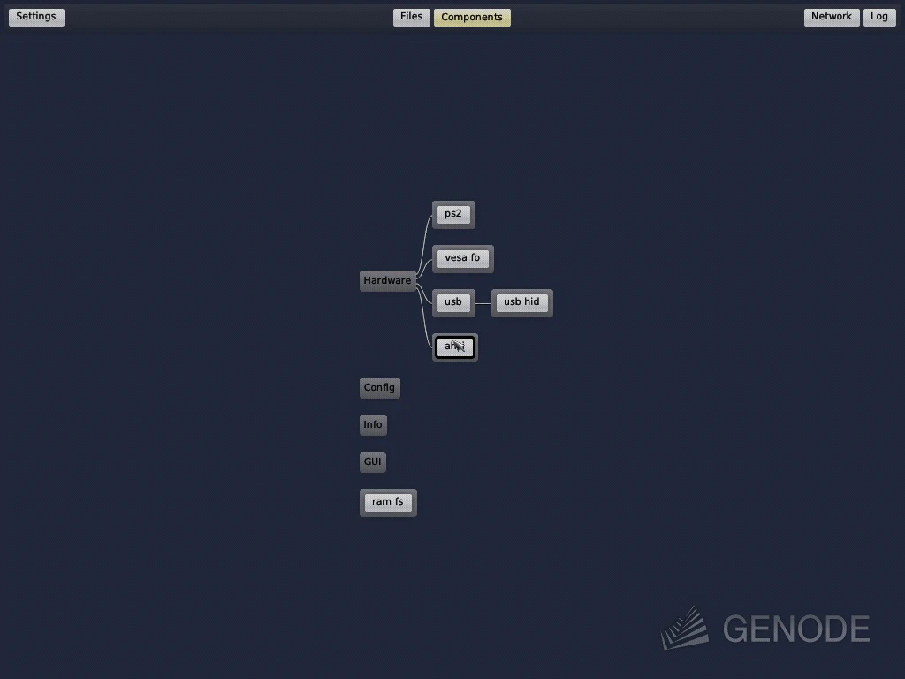

# Kernel Hive

**Virtual computer museum streamed into your browser. 90+ operating systems
ready for your interaction instantly, spanning from 1970 to modern times —
with highly optimized round-trip latency.**

<a href="https://kernelhive.madekivi.fi">
  
</a>


*Gallery grid view. Classic Windows 3.11.*

[](LICENSE)
[](streamhost/LICENSE)

## Major features

- **Instant machines.** Every guest launches from a full machine-state
  checkpoint — RAM, devices and disk together — and waits paused; the first
  visitor resumes it. A 1999 Alpha workstation is on screen in seconds.
  ([`docs/GUEST-TIERS.md`](docs/GUEST-TIERS.md))
- **A latency-first pipeline, end to end.** Input rides **WebTransport over
  QUIC/UDP**: pointer moves as unreliable datagrams, keys and clicks on their
  own reliable streams, so no class ever blocks another. The whole host-side
  critical path is **Rust** — one daemon per machine pulls a frame only when the
  emulator reports damage, encodes it in-process with **libx264 tuned for zero
  latency**, and ships one access unit per QUIC stream straight into
  **WebCodecs** in the browser. Measured LAN click-to-photon: **~20–25 ms**,
  down from ~200 ms on the WebRTC stack it replaced.
  ([`docs/INPUT-LATENCY.md`](docs/INPUT-LATENCY.md),
  [`docs/ARCHITECTURE.md`](docs/ARCHITECTURE.md))
- **Headless, low-overhead emulators.** On the host-native path there is no X
  server and no virtual display: QEMU, MAME, VICE, FS-UAE and es40 publish
  their framebuffer straight into shared memory and take input over a control
  socket. An idle desktop costs nothing to stream, and an unwatched machine is
  paused outright. ([`streamhost/docs/DESIGN.md`](streamhost/docs/DESIGN.md),
  [`streamhost/docs/IDLE-PAUSE.md`](streamhost/docs/IDLE-PAUSE.md))
- **Absolute cursor positioning, on every kind of guest.** Machines that only
  understand relative mouse motion still put the cursor exactly under yours:
  closed-loop readback from the graphics chip's registers (AIX, HP-UX), the
  coordinate written into the place the OS keeps its own pointer (classic Mac
  OS, BeOS, Rhapsody, DOS GUIs), or the guest's own X server warped from
  outside (Amiga UNIX, the Linux and BSD fleet).
  ([`docs/lab/INPUT-DEBUGGING.md`](docs/lab/INPUT-DEBUGGING.md))
- **Patched emulators.** MAME, QEMU, VICE, FS-UAE and es40 are all forked for
  shared-memory scanout, control-socket input, savestates and the device models
  these machines needed — see [Emulator forks](#emulator-forks).
- **A private 1990s internet.** Period browsers reach an archived 1998 web;
  ICQ, AIM and IRC connect the machines to each other and to a chatbot. No
  route to today. ([`docs/lab/RETRONET-BRIEF.md`](docs/lab/RETRONET-BRIEF.md))
- **Walk-in machines.** Sign up with a passkey and get a private clone of
  Windows 3.11, OS/2 Warp or Rhapsody, reaped after the visit.
  ([`docs/lab/WALKIN-BRIEF.md`](docs/lab/WALKIN-BRIEF.md))

## Visit the museum

**[kernelhive.madekivi.fi](https://kernelhive.madekivi.fi)**

Walk in, register on the spot and get a private machine for the visit.
An invited account opens the whole floor: every live machine, its write-up,
photographs of the real hardware, and the private 1990s internet. Sign-in is a
passkey; there is no password. The public path — edge, gates, media plane — is
[`docs/PUBLIC-GALLERY.md`](docs/PUBLIC-GALLERY.md).

## The lineup

Every machine on the floor, by the decade it came from. Each one is a link
straight into the running system.

<!-- lineup:start -->
### 1970s

<table>
<tr>
<td align="center"><a href="https://kernelhive.madekivi.fi/os/decos"></a><br><sub>DEC PDP-11 — RT-11, RSX-11M, RSTS/E · 1970</sub></td>
<td align="center"><a href="https://kernelhive.madekivi.fi/os/alto"></a><br><sub>Xerox Alto II · 1973</sub></td>
<td align="center"><a href="https://kernelhive.madekivi.fi/os/gt40"></a><br><sub>DEC GT40 · 1973</sub></td>
<td align="center"><a href="https://kernelhive.madekivi.fi/os/pdp11"></a><br><sub>DEC PDP-11/70 — 2.11BSD · 1975</sub></td>
<td align="center"><a href="https://kernelhive.madekivi.fi/os/pet2001"></a><br><sub>Commodore PET 2001 · 1977</sub></td>
</tr>
</table>

### 1980s

<table>
<tr>
<td align="center"><a href="https://kernelhive.madekivi.fi/os/cbm8032"></a><br><sub>Commodore CBM 8032 · 1980</sub></td>
<td align="center"><a href="https://kernelhive.madekivi.fi/os/vic20"></a><br><sub>Commodore VIC-20 · 1980</sub></td>
<td align="center"><a href="https://kernelhive.madekivi.fi/os/bbcmicro"></a><br><sub>Acorn BBC Micro Model B · 1981</sub></td>
<td align="center"><a href="https://kernelhive.madekivi.fi/os/star"></a><br><sub>Xerox Star 8010 · 1981</sub></td>
<td align="center"><a href="https://kernelhive.madekivi.fi/os/zx81"></a><br><sub>Sinclair ZX81 · 1981</sub></td>
<td align="center"><a href="https://kernelhive.madekivi.fi/os/c64"></a><br><sub>Commodore 64 · 1982</sub></td>
</tr>
<tr>
<td align="center"><a href="https://kernelhive.madekivi.fi/os/cbm2"></a><br><sub>Commodore CBM 610 · 1982</sub></td>
<td align="center"><a href="https://kernelhive.madekivi.fi/os/dragon32"></a><br><sub>Dragon 32 · 1982</sub></td>
<td align="center"><a href="https://kernelhive.madekivi.fi/os/mpf2"></a><br><sub>Multitech Microprofessor II · 1982</sub></td>
<td align="center"><a href="https://kernelhive.madekivi.fi/os/zxspectrum"></a><br><sub>Sinclair ZX Spectrum 48K · 1982</sub></td>
<td align="center"><a href="https://kernelhive.madekivi.fi/os/atari800xl"></a><br><sub>Atari 800XL · 1983</sub></td>
<td align="center"><a href="https://kernelhive.madekivi.fi/os/lisa"></a><br><sub>Lisa Office System 3.1 · 1984</sub></td>
</tr>
<tr>
<td align="center"><a href="https://kernelhive.madekivi.fi/os/oricatmos"></a><br><sub>Oric Atmos · 1984</sub></td>
<td align="center"><a href="https://kernelhive.madekivi.fi/os/plus4"></a><br><sub>Commodore Plus/4 · 1984</sub></td>
<td align="center"><a href="https://kernelhive.madekivi.fi/os/sinclairql"></a><br><sub>Sinclair QL · 1984</sub></td>
<td align="center"><a href="https://kernelhive.madekivi.fi/os/a1000"></a><br><sub>Amiga 1000 · 1985</sub></td>
<td align="center"><a href="https://kernelhive.madekivi.fi/os/amstradcpc"></a><br><sub>Amstrad CPC 6128 · 1985</sub></td>
<td align="center"><a href="https://kernelhive.madekivi.fi/os/apple2e"></a><br><sub>Apple //e · 1985</sub></td>
</tr>
<tr>
<td align="center"><a href="https://kernelhive.madekivi.fi/os/atarist"></a><br><sub>Atari ST (EmuTOS GEM) · 1985</sub></td>
<td align="center"><a href="https://kernelhive.madekivi.fi/os/c128"></a><br><sub>Commodore 128 · 1985</sub></td>
<td align="center"><a href="https://kernelhive.madekivi.fi/os/daybreak"></a><br><sub>Xerox 6085 · 1985</sub></td>
<td align="center"><a href="https://kernelhive.madekivi.fi/os/armeval"></a><br><sub>Acorn ARM Evaluation System · 1986</sub></td>
<td align="center"><a href="https://kernelhive.madekivi.fi/os/amiga"></a><br><sub>Amiga 500 · 1987</sub></td>
<td align="center"><a href="https://kernelhive.madekivi.fi/os/medley"></a><br><sub>Interlisp Medley · 1987</sub></td>
</tr>
<tr>
<td align="center"><a href="https://kernelhive.madekivi.fi/os/apple2"></a><br><sub>Apple II · 1988</sub></td>
<td align="center"><a href="https://kernelhive.madekivi.fi/os/kc854"></a><br><sub>KC 85/4 · 1988</sub></td>
<td align="center"><a href="https://kernelhive.madekivi.fi/os/samcoupe"></a><br><sub>SAM Coupé · 1989</sub></td>
</tr>
</table>

### 1990s

<table>
<tr>
<td align="center"><a href="https://kernelhive.madekivi.fi/os/a3000"></a><br><sub>Amiga 3000 · 1990</sub></td>
<td align="center"><a href="https://kernelhive.madekivi.fi/os/newsos"></a><br><sub>NEWS-OS 4.1R · 1991</sub></td>
<td align="center"><a href="https://kernelhive.madekivi.fi/os/amix"></a><br><sub>Amiga UNIX (AMIX) · 1992</sub></td>
<td align="center"><a href="https://kernelhive.madekivi.fi/os/aux"></a><br><sub>A/UX 3.0.1 · 1993</sub></td>
<td align="center"><a href="https://kernelhive.madekivi.fi/os/indyr4400"></a><br><sub>SGI Indy R4400 · 1993</sub></td>
<td align="center"><a href="https://kernelhive.madekivi.fi/os/irix"></a><br><sub>SGI Indy · 1993</sub></td>
</tr>
<tr>
<td align="center"><a href="https://kernelhive.madekivi.fi/os/pcgeos"></a><br><sub>PC/GEOS Ensemble · 1993</sub></td>
<td align="center"><a href="https://kernelhive.madekivi.fi/os/win311"></a><br><sub>Windows 3.11 · 1993</sub></td>
<td align="center"><a href="https://kernelhive.madekivi.fi/os/freedos"></a><br><sub>FreeDOS · 1994</sub></td>
<td align="center"><a href="https://kernelhive.madekivi.fi/os/msdoswin1"></a><br><sub>MS-DOS 6.22 + Windows 1.0 · 1994</sub></td>
<td align="center"><a href="https://kernelhive.madekivi.fi/os/solaris"></a><br><sub>Solaris CDE · 1994</sub></td>
<td align="center"><a href="https://kernelhive.madekivi.fi/os/sunos414"></a><br><sub>SunOS 4.1.4 / OpenWindows · 1994</sub></td>
</tr>
<tr>
<td align="center"><a href="https://kernelhive.madekivi.fi/os/nextstep"></a><br><sub>NeXTSTEP 3.3 · 1995</sub></td>
<td align="center"><a href="https://kernelhive.madekivi.fi/os/nt351"></a><br><sub>Windows NT 3.51 · 1995</sub></td>
<td align="center"><a href="https://kernelhive.madekivi.fi/os/win95"></a><br><sub>Windows 95 · 1995</sub></td>
<td align="center"><a href="https://kernelhive.madekivi.fi/os/hpuxvue"></a><br><sub>HP-UX 10.20 / HP VUE · 1996</sub></td>
<td align="center"><a href="https://kernelhive.madekivi.fi/os/macos753"></a><br><sub>Mac OS 7.5.3 · 1996</sub></td>
<td align="center"><a href="https://kernelhive.madekivi.fi/os/nt4"></a><br><sub>Windows NT 4.0 · 1996</sub></td>
</tr>
<tr>
<td align="center"><a href="https://kernelhive.madekivi.fi/os/os2warp"></a><br><sub>OS/2 Warp 4 · 1996</sub></td>
<td align="center"><a href="https://kernelhive.madekivi.fi/os/slackware"></a><br><sub>Slackware 3.4 · 1997</sub></td>
<td align="center"><a href="https://kernelhive.madekivi.fi/os/rhapsody"></a><br><sub>Rhapsody DR2 · 1998</sub></td>
<td align="center"><a href="https://kernelhive.madekivi.fi/os/aix432"></a><br><sub>IBM RS/6000 — AIX 4.3.3 · 1999</sub></td>
<td align="center"><a href="https://kernelhive.madekivi.fi/os/netbsd14"></a><br><sub>NetBSD 1.4.1 · 1999</sub></td>
<td align="center"><a href="https://kernelhive.madekivi.fi/os/w2kalpha"></a><br><sub>Windows 2000 for Alpha · 1999</sub></td>
</tr>
<tr>
<td align="center"><a href="https://kernelhive.madekivi.fi/os/win98se"></a><br><sub>Windows 98 SE · 1999</sub></td>
</tr>
</table>

### 2000s

<table>
<tr>
<td align="center"><a href="https://kernelhive.madekivi.fi/os/beos"></a><br><sub>BeOS R5 · 2000</sub></td>
<td align="center"><a href="https://kernelhive.madekivi.fi/os/debian22"></a><br><sub>Debian GNU/Linux 2.2 · 2000</sub></td>
<td align="center"><a href="https://kernelhive.madekivi.fi/os/redhat62"></a><br><sub>Red Hat Linux 6.2 · 2000</sub></td>
<td align="center"><a href="https://kernelhive.madekivi.fi/os/suse64"></a><br><sub>SuSE Linux 6.4 · 2000</sub></td>
<td align="center"><a href="https://kernelhive.madekivi.fi/os/win2000"></a><br><sub>Windows 2000 · 2000</sub></td>
<td align="center"><a href="https://kernelhive.madekivi.fi/os/macos9"></a><br><sub>Mac OS 9.2.2 · 2001</sub></td>
</tr>
<tr>
<td align="center"><a href="https://kernelhive.madekivi.fi/os/winxp"></a><br><sub>Windows XP · 2001</sub></td>
<td align="center"><a href="https://kernelhive.madekivi.fi/os/chokanji"></a><br><sub>Chokanji (超漢字) · 2002</sub></td>
<td align="center"><a href="https://kernelhive.madekivi.fi/os/tru64"></a><br><sub>Tru64 UNIX · 2003</sub></td>
<td align="center"><a href="https://kernelhive.madekivi.fi/os/kolibrios"></a><br><sub>KolibriOS · 2004</sub></td>
<td align="center"><a href="https://kernelhive.madekivi.fi/os/ubuntu"></a><br><sub>Ubuntu 4.10 Warty Warthog · 2004</sub></td>
<td align="center"><a href="https://kernelhive.madekivi.fi/os/alpine"></a><br><sub>Alpine Linux · 2005</sub></td>
</tr>
<tr>
<td align="center"><a href="https://kernelhive.madekivi.fi/os/freebsd411"></a><br><sub>FreeBSD 4.11 · 2005</sub></td>
<td align="center"><a href="https://kernelhive.madekivi.fi/os/helenos"></a><br><sub>HelenOS · 2006</sub></td>
<td align="center"><a href="https://kernelhive.madekivi.fi/os/pcbsd"></a><br><sub>PC-BSD 1.5.1 · 2008</sub></td>
<td align="center"><a href="https://kernelhive.madekivi.fi/os/redstar2"></a><br><sub>Red Star OS 2.0 · 2009</sub></td>
<td align="center"><a href="https://kernelhive.madekivi.fi/os/tinycore"></a><br><sub>Tiny Core Linux · 2009</sub></td>
</tr>
</table>

### 2010s–2020s

<table>
<tr>
<td align="center"><a href="https://kernelhive.madekivi.fi/os/qnx"></a><br><sub>QNX Neutrino 6.5 · 2010</sub></td>
<td align="center"><a href="https://kernelhive.madekivi.fi/os/ninefront"></a><br><sub>9front (Plan 9) · 2011</sub></td>
<td align="center"><a href="https://kernelhive.madekivi.fi/os/toaruos"></a><br><sub>ToaruOS · 2011</sub></td>
<td align="center"><a href="https://kernelhive.madekivi.fi/os/redstar3"></a><br><sub>Red Star OS 3.0 Desktop · 2013</sub></td>
<td align="center"><a href="https://kernelhive.madekivi.fi/os/templeos"></a><br><sub>TempleOS · 2013</sub></td>
<td align="center"><a href="https://kernelhive.madekivi.fi/os/serenityos"></a><br><sub>SerenityOS · 2018</sub></td>
</tr>
<tr>
<td align="center"><a href="https://kernelhive.madekivi.fi/os/bootos"></a><br><sub>bootOS · 2019</sub></td>
<td align="center"><a href="https://kernelhive.madekivi.fi/os/win11"></a><br><sub>Windows 11 · 2021</sub></td>
<td align="center"><a href="https://kernelhive.madekivi.fi/os/aros"></a><br><sub>AROS · 2024</sub></td>
<td align="center"><a href="https://kernelhive.madekivi.fi/os/haiku"></a><br><sub>Haiku R1/beta5 · 2024</sub></td>
<td align="center"><a href="https://kernelhive.madekivi.fi/os/openvms"></a><br><sub>OpenVMS x86-64 9.2 · 2024</sub></td>
<td align="center"><a href="https://kernelhive.madekivi.fi/os/reactos"></a><br><sub>ReactOS 0.4.14 · 2024</sub></td>
</tr>
<tr>
<td align="center"><a href="https://kernelhive.madekivi.fi/os/ravynos"></a><br><sub>ravynOS · 2025</sub></td>
<td align="center"><a href="https://kernelhive.madekivi.fi/os/sculpt"></a><br><sub>Genode Sculpt OS · 2025</sub></td>
<td align="center"><a href="https://kernelhive.madekivi.fi/os/openbsd"></a><br><sub>OpenBSD 7.9 · 2026</sub></td>
</tr>
</table>
<!-- lineup:end -->


## Inside the museum

<!-- museum-views:start -->
<!-- museum-views:end -->


## How it works


One Rust daemon per machine: damage-gated capture from shared memory, QMP or an
in-guest agent; in-process x264 + Opus; WebTransport to the browser; input
injected back by whichever channel the guest supports. Behind it, a patched
emulator restored from a checkpoint. [`docs/ARCHITECTURE.md`](docs/ARCHITECTURE.md)
is the map into the rest.

## Emulator forks

<!-- forks:start -->
Every emulator behind the museum is forked and patched for headless, low-overhead
streaming: a shared-memory framebuffer instead of a window, a control socket for
paced input with an absolute mouse, savestates that actually restore, and the
device models the guests needed. One commit per patch, on the pinned branch.

| Fork | Machines | What we patched | ≈ our diff |
|---|---|---|---|
| [Wnt/mame](https://github.com/Wnt/mame) (`irix`, `mpf2`) | SGI Indy, Microprofessor II | R4600 DRC cache, GIO64/Newport shared-memory framebuffer, a control-socket OSD module for headless input, PS/2 mouse and DMA/RTC fixes | 3.5k lines, 16 commits |
| [Wnt/qemu](https://github.com/Wnt/qemu) (`kernel-hive`, `aix432-s3`) | Rhapsody, Mac OS 7.5.3, AIX, and the x86 fleet's patch set | dbus console fast-poll, a low-latency `gallery-hid` input device, Cirrus VGA vmstate and ROP fixes, PPC timebase migration, absolute pointer by writing guest RAM, closed-loop 1:1 pointer over the hardware cursor; AIX carries forward-ported S3 Trio and Matrox MGA models | 3.4k lines, 14 commits |
| [Wnt/vice](https://github.com/Wnt/vice) (`kernel-hive/integrated`) | C64, C128, CBM-II, PET, Plus/4, VIC-20 | headless control-socket input with keymap, shared-memory framebuffer, CRTC restore fixes, raw-PCM audio FIFO, in-process save/load state via a CPU trap | 4.4k lines, 14 commits |
| [Wnt/es40](https://github.com/Wnt/es40) (`main`) | Windows 2000 Alpha, Tru64 UNIX | JIT chain-exit and compile fixes, working savestate and instant resume, paced absolute pointer with per-guest gain, live checkpoint verb, host-freeze absorption | 1.6k lines, 19 commits |
| [Wnt/fs-uae](https://github.com/Wnt/fs-uae) (`kernel-hive/integrated`) | Amiga 1000, Amiga 3000, AmigaOS 3.5, Amiga UNIX | headless native entry (no window, GL or X), shared-memory framebuffer, control socket with mousehack re-arm after restore, 48 kHz PCM FIFO, clean SIGTERM | 1.5k lines, 11 commits |
| [Wnt/previous](https://github.com/Wnt/previous) (`kernel-hive`) | NeXTSTEP | shared-memory framebuffer, control-socket input paced to the keyboard floor, framebuffer republish and network down/up around checkpoints, raw-PCM audio FIFO | 1.7k lines, 12 commits |

Line counts are additions plus deletions in our own commits, measured against
each fork's merge base on 2026-09-09; upstream history the branches carry is not
counted. Design notes: [`docs/lab/ES40-FORK-BRIEF.md`](docs/lab/ES40-FORK-BRIEF.md),
[`docs/lab/FSUAE-NATIVE-BRIEF.md`](docs/lab/FSUAE-NATIVE-BRIEF.md),
[`third_party/mame-irix/README.md`](third_party/mame-irix/README.md),
[`streamhost/qemu-patches/`](streamhost/qemu-patches/).
<!-- forks:end -->

## This week at the museum

The museum keeps a written account of every week. The latest one:

<!-- release-notes:start -->
### Week 5 · Nine Unixes in one night · 2026-08-30 09:00 – 2026-09-06 09:00

#### Screenshots

<table>
<tr>
<td><a href="https://kernelhive.madekivi.fi/os/slackware"></a><br><sub>Slackware 3.4</sub></td>
<td><a href="https://kernelhive.madekivi.fi/os/netbsd14"></a><br><sub>NetBSD 1.4.1</sub></td>
<td><a href="https://kernelhive.madekivi.fi/os/redhat62"></a><br><sub>Red Hat Linux 6.2</sub></td>
<td><a href="https://kernelhive.madekivi.fi/os/debian22"></a><br><sub>Debian GNU/Linux 2.2</sub></td>
</tr>
<tr>
<td><a href="https://kernelhive.madekivi.fi/os/suse64"></a><br><sub>SuSE Linux 6.4</sub></td>
<td><a href="https://kernelhive.madekivi.fi/os/ubuntu"></a><br><sub>Ubuntu 4.10 Warty Warthog</sub></td>
<td><a href="https://kernelhive.madekivi.fi/os/freebsd411"></a><br><sub>FreeBSD 4.11</sub></td>
<td><a href="https://kernelhive.madekivi.fi/os/pcbsd"></a><br><sub>PC-BSD 1.5.1</sub></td>
</tr>
</table>

<u>Nine Unix and Linux machines arrived in a single night.</u> [Slackware 3.4](https://kernelhive.madekivi.fi/os/slackware) brings 1997's **fvwm95**, the desktop that made a Unix workstation look like Windows 95; [NetBSD 1.4.1](https://kernelhive.madekivi.fi/os/netbsd14) follows from 1999. The year 2000 gives three at once — [Red Hat Linux 6.2 "Zoot"](https://kernelhive.madekivi.fi/os/redhat62) with **GNOME 1.0**, [Debian 2.2 "potato"](https://kernelhive.madekivi.fi/os/debian22), and [SuSE Linux 6.4](https://kernelhive.madekivi.fi/os/suse64) with **KDE 1**, from the last spring SuSE spelled itself with a small u. [Ubuntu 4.10 "Warty Warthog"](https://kernelhive.madekivi.fi/os/ubuntu) is the very first Ubuntu, running off its live CD, so every reset returns to the same instant. [FreeBSD 4.11](https://kernelhive.madekivi.fi/os/freebsd411) closes the 4.x line with the full **KDE 3.3.2**; [PC-BSD 1.5.1](https://kernelhive.madekivi.fi/os/pcbsd) is FreeBSD made point-and-click; [OpenBSD 7.9](https://kernelhive.madekivi.fi/os/openbsd) stands at the modern end. Earlier in the week came [Amiga UNIX](https://kernelhive.madekivi.fi/os/amix), Commodore's *System V Release 4* with **OPEN LOOK**, in colour on the **A2410** card most owners never bought; [ravynOS](https://kernelhive.madekivi.fi/os/ravynos); [PC/GEOS Ensemble](https://kernelhive.madekivi.fi/os/pcgeos), a 1990 desktop in *640 KB on a 286*; and [bootOS](https://kernelhive.madekivi.fi/os/bootos), a whole operating system in *512 bytes*. That makes 87 machines, 85 of them open to visitors.

Read [week 5 in full](docs/RELEASE-NOTES.md#week-5), and every earlier week, in the [full archive](docs/RELEASE-NOTES.md).

Every machine named here is live at [kernelhive.madekivi.fi](https://kernelhive.madekivi.fi).
<!-- release-notes:end -->

## A reading tour

Five documents worth reading even if you never run any of this.

1. [`docs/ARCHITECTURE.md`](docs/ARCHITECTURE.md) — the whole system in one
   sitting, including the awkward truth that for a large part of the collection
   the thing being captured is not the machine you came to see, but a bare
   Linux screen with a period emulator filling it edge to edge.
2. [`docs/INPUT-LATENCY.md`](docs/INPUT-LATENCY.md) — where every millisecond
   between a key press and the pixel changing actually goes, stage by stage,
   measured rather than assumed, with what is left to win.
3. [`docs/lab/nt4-cirrus-vmstate-trace-fix.md`](docs/lab/nt4-cirrus-vmstate-trace-fix.md)
   — a detective story: Windows NT 4 cold-boots to a clean desktop but always
   restores a blue-lavender one, and the culprit is a struct being read at the
   wrong offset. The before-and-after screenshots are in
   [`docs/lab/nt4-cirrus-vmstate-proofs/`](docs/lab/nt4-cirrus-vmstate-proofs/).
4. [`docs/lab/RETRONET-BRIEF.md`](docs/lab/RETRONET-BRIEF.md) — the design for
   an internet that only goes backwards: what a 1997 browser needs, why every
   service is offline by construction, and what it costs to put a real machine
   on it without breaking it.
5. [`docs/guests/irix.md`](docs/guests/irix.md) — one machine, at length. An
   SGI Indy with no window, no virtual machine and no display at all, publishing
   frames into shared memory, and the long list of performance angles that were
   measured and closed — including the one closed in error and reopened.

If a word in any of these is unfamiliar,
[`docs/GLOSSARY.md`](docs/GLOSSARY.md) is the whole vocabulary on one page.

---

<details>
<summary><b>Status — a home lab, not a product</b></summary>

<br>

Personal home-lab project. Everything here is built against one specific
machine ("the lab box"), a single Proxmox host. The code is published for
reading, reuse and reference; reproducing the full gallery is real work, and
the docs describe that work rather than hiding it behind an installer.

The public gallery is reachable over the internet, but every session is
authenticated — by passkey, on an invited account or a self-registered one.

</details>

<details>
<summary><b>Building the pieces</b></summary>

<br>

**SPA** (works on any machine with Node.js and npm):

```sh
cd spa
npm ci
npm run build     # a placeholder src/data/credentials.ts is created
                  # automatically from credentials.example.ts
npm run dev       # local dev server
```

**streamhost** (Linux; links the system libx264):

```sh
sudo apt-get install libx264-dev libopus-dev libclang-dev pkg-config cmake
cd streamhost
cargo build --release
cargo test
```

Everything else — station launchers, seed-image builders, `labctl` — assumes
the Proxmox lab host and its VM inventory. Follow the
[reproduction quickstart](docs/REPRODUCE-QUICKSTART.md) for the required
external inputs and the ordered full-box runbook chain.

</details>

<details>
<summary><b>Hardware and scope</b></summary>

<br>

This assumes a single Linux host (Proxmox VE in production) with enough CPU and
RAM to run the fleet plus a per-station encoder. The kernelhive.madekivi.fi host
is a 6+ years old Supermicro server with no GPU. There is no cloud deployment path and no installer: the
[reproduction quickstart](docs/REPRODUCE-QUICKSTART.md) separates what builds on
any machine (the SPA, the `streamhost` daemon) from what only makes sense
against the Proxmox host and its VM inventory (station launchers, seed-image
builders, `labctl`).

</details>

<details>
<summary><b>Repository layout</b></summary>

<br>

| Path | What lives there |
| --- | --- |
| `streamhost/` | Rust streaming daemon (WebTransport + in-process libx264/Opus), per-station launchers, in-guest agents, crate docs in `streamhost/docs/` — **GPL-2.0-or-later** |
| `spa/` | The gallery front-end: Vite + React + TypeScript, WebCodecs decode |
| `tests/e2e-live/` | Playwright suite that drives the *live* lab box — not run in CI |
| `scripts/` | Ops tooling: `labctl` (unified box CLI), `build-guests/` (per-OS seed-image builders), `serve/` (HTTPS server for the SPA), `dev/` (build-and-deploy loop) — indexed in [`scripts/README.md`](scripts/README.md) |
| `registry/` | The station registry (source of truth for the roster) and per-station poster prose |
| `docs/` | `lab/` runbooks and hardware notes, `guests/` per-OS notes, `catalog/` media and software catalogs, `history/` retired status docs — indexed in [`docs/README.md`](docs/README.md) |
| `.github/workflows/` | CI: Rust fmt/clippy/test, SPA lint/build, shell + Python + workflow lint |

</details>

<details>
<summary><b>Addresses and hostnames in these docs are placeholders</b></summary>

<br>

Every IP, hostname and domain shown in this repository (`192.0.2.10`,
`labhost.lan`, `example.com`, and similar RFC 5737 / `.example` values) is a
stand-in for the operator's real lab box, substituted throughout before this
repo was published. The one deliberate exception is the gallery's own public
address, `kernelhive.madekivi.fi`.

Placeholders are not wrong values to fix, and they will not resolve —
reproducing the stack means supplying your own via `registry/local.env` (see
`registry/local.env.example` and [`registry/README.md`](registry/README.md)) and
the other gitignored, operator-local files listed in `.gitignore`. A deployment
left on the placeholders builds but is unreachable. Please don't submit patches
that put real addresses, hostnames or credentials back into the repo.

</details>

<details>
<summary><b>Contributing</b></summary>

<br>

See [`CONTRIBUTING.md`](CONTRIBUTING.md): what can be built and verified
without lab hardware, the CI quality gate, and PR expectations.

</details>

<details>
<summary><b>License</b></summary>

<br>

The repository is MIT-licensed (see `LICENSE`), with two exceptions:

- `streamhost/` is **GPL-2.0-or-later** (see `streamhost/LICENSE`) because the
  daemon links the system libx264, which is GPL. The two trees are independent
  — nothing outside `streamhost/` links against it.
- The historical photographs under `spa/public/posters/*/gallery/` are
  third-party works reused under free licenses (public domain, CC0, CC BY,
  CC BY-SA) and remain their authors' property. Every image's author, license
  and source page is listed in [`docs/IMAGE-CREDITS.md`](docs/IMAGE-CREDITS.md);
  the licenses are enforced mechanically against the Wikimedia Commons API by
  `scripts/tools/fetch-poster-gallery.py` (re-check with
  `make poster-gallery-verify`). CC BY-SA images carry share-alike obligations
  on modified redistribution.

</details>
