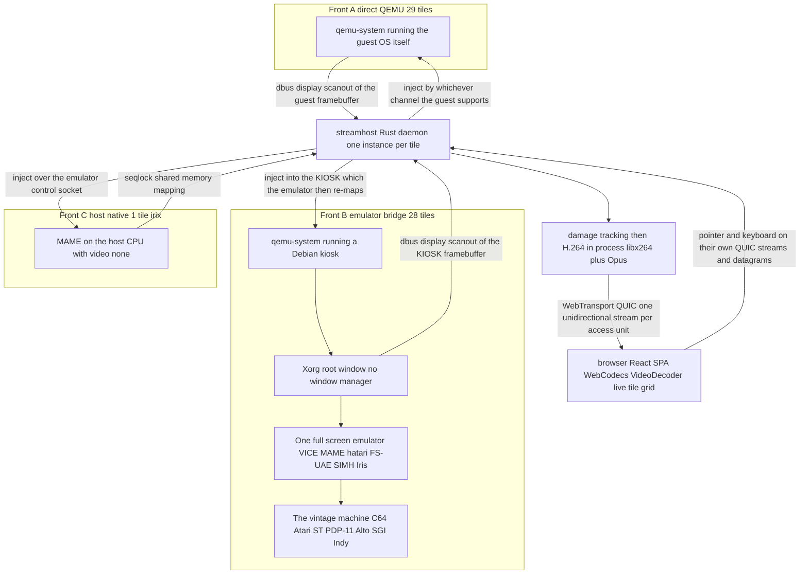

# Architecture

Technical overview of how Kernel Hive gets a guest OS's screen into a
browser tab and a visitor's keystrokes back into the guest. This is a map
into the deeper docs, not a replacement for them — each section links to
the file that actually specifies the behavior.

## The streaming path, end to end

The whole system converges on one pipeline — capture, damage, encode,
transport — but **what sits in front of that pipeline differs per tile, and
for nearly half the fleet it is not the machine you came to see.**



**Note where the arrow into `streamhost` starts on Front B.** It leaves the
*kiosk's* X root window, not the emulator and not the vintage machine. On those
28 tiles there is an entire Linux guest between the exhibit and the encoder, and
what actually gets H.264-encoded is that Linux guest's framebuffer, which
happens to be filled edge to edge by one full-screen emulator window. There is
no window manager precisely so that nothing else can ever appear in the frame.

That layering is not a detail — it is where a whole class of behaviour comes
from:

- **Input crosses two coordinate mappings, not one.** The browser's guest-pixel
  coordinates land on the kiosk's `usb-tablet` and become an X pointer position;
  the emulator then applies *its own* mapping to reach the emulated machine.
  Each mapping has to be verified separately, and some emulators are
  relative-only inside and need edge re-homing.
- **It costs about +9 ms**, mostly a Linux compositing term paid before QEMU is
  even polled, and more when the inner emulator is busy.
- **It changes what capture costs.** A 32bpp kiosk surface is not
  memfd-shareable, so those tiles fall back to QEMU's copy path.
- **"The tile is up" and "the exhibit is up" are different claims.** The kiosk
  can be perfectly healthy while the emulator inside it is dead — which is
  exactly how a migrated tile can render a black screen while every log, exit
  code and assertion reports success.

Front C inverts the usual assumption in the other direction: `irix` has **no
QEMU and no QMP at all**, because MAME's SGI Indy emulation kernel-panics under
a KVM vCPU. A fourth front, `openvms`, runs *two* sibling VMs where the captured
one does nothing but serve X. The full taxonomy is in
[`GUEST-TIERS.md`](GUEST-TIERS.md).

Each tile runs its own `streamhost` process; there is no shared fan-out
server on the media path. A `streamhost@<tile>` systemd unit per tile is
what's deployed on the lab box (see `AGENTS.md`'s access map for how an
operator reaches a running tile).

Design and the reasoning behind each piece: `streamhost/docs/DESIGN.md`.
Encoder/transport latency work and the measured numbers:
`streamhost/docs/LATENCY-NOTES.md`, `docs/INPUT-LATENCY.md`. The dbus-based
fast-poll QEMU patch that cuts capture latency: `streamhost/docs/CAPTURE-FASTPOLL.md`.
Idle-tile auto-pause/resume: `streamhost/docs/IDLE-PAUSE.md`. The `SH_*`
environment-variable reference: `streamhost/docs/CONFIG.md`.

## The daemon's responsibilities

One `streamhost` process, per tile, owns:

- **Capture** — pulling frames from the guest only when the emulator
  signals display damage (no fixed-rate re-encode of an unchanged screen).
- **Encode** — a dedicated `sh-encode` thread holding the x264 handle,
  constant-quality encoding with ABR tiers driven by client RTT/loss/queue
  feedback.
- **Transport** — WebTransport/QUIC to the browser: one H.264 Annex-B
  access unit per unidirectional stream, decoded on stream completion; a
  forced keyframe on join so a new viewer never waits for the next GOP.
- **Input** — receiving pointer/keyboard/wheel events from the browser and
  injecting them into the guest by whichever channel that guest supports
  (see below), each input class on its own QUIC stream so one class can't
  block another.
- **Session gating** — refusing any WebTransport session that doesn't
  present a valid ticket for that tile (see "Session tickets" below).
- **Idle management** — QMP-pausing an unwatched guest after a grace
  period and resuming it on the next visitor.

Source: `streamhost/streamhost/src/`. Per-tile launch scripts (the exact
device set, capture channel, and any in-guest agent a tile needs) live
under `streamhost/tiles/<tile>/` and `scripts/build-guests/`.

## The tile / registry model

A **tile** is one guest OS instance: an emulator process, its `streamhost`
capture/encode/transport wrapper, a golden disk image with a known-good
snapshot to reset to, and an entry in the registry describing all of that.
`registry/tiles/<osId>.json` is the single typed source of truth (schema at
`registry/schema/tile-v1.schema.json`); `scripts/tiles-registry.py generate`
renders it into the deployed artifacts (the manifest `streamhost` consumes,
the serve JSONs, SPA poster data), and `scripts/tiles-registry.py render`
resolves the two never-committed documents — the public
`gallery-manifest.json` the SPA fetches and the whole-registry `index.json`.
Never hand-edit a generated file — edit the registry source and regenerate;
`make tile-registry-check` fails a drifted generated file. Current roster size:

```sh
python3 scripts/tiles-registry.py count
```

A registry entry records a tile's **lifecycle** (`production` — running
live; `showcase` — poster-only, backend retired; also `experiment` and
`candidate` for work in progress), its build recipe, its runtime env
(`SH_*` vars, ports), and — for production tiles — a poster (prose in
`registry/posters/`, hero image at `spa/public/posters/<tile>/desktop.webp`)
so an exhibit is never live without something to show for it.

An optional `listing: { state: "hidden", reason, since }` block **soft-hides** an
exhibit: it drops out of the grid, the 3D hall and their counts while staying a
full lineup entry — the manifest still carries its row (flagged
`"listed": false`), so `/os/<id>` still resolves and streams. That is
discoverability, not access control; anyone with the URL gets in. Use it for a
dark launch or an exhibit temporarily off the floor, and `enabled: false` (which
removes the row, and the deep link with it) to retire one. Field reference:
[`registry/README.md`](../registry/README.md).

Turning a guest into a tile is the subject of
[`docs/lab/ADD-NEW-OS-PLAYBOOK.md`](lab/ADD-NEW-OS-PLAYBOOK.md) — sourcing
install media, building a golden image, wiring the registry entry, and the
acceptance checks a new tile has to pass before it ships.

## Guest tiers

The three capture fronts above are what `streamhost` *sees*. The full structural
taxonomy is slightly wider — **five tiers** — because two kinds of tile do not
show up as a capture front at all: the showcase posters have no runtime to
capture, and `openvms` is a second QEMU hiding behind Front A's arrow. Which
tier a tile is determines its input path, its capture backend and most of its
cost:

| Tier | Count | What runs | Layers to the exhibit |
|---|---:|---|---|
| **1 — direct QEMU** | 29 | The guest OS itself in one QEMU | 1 VM |
| **2 — emulator bridge** | 28 | A Debian bare-X kiosk whose only job is to run one full-screen period emulator | 2 |
| **3 — host-native** | 1 | MAME on the bare-metal host, no QEMU and no QMP (`irix`) | 1 |
| **4 — two-QEMU X bridge** | 1 | Two sibling VMs; the captured one runs only Xorg (`openvms`) | 1, produced by a second VM |
| **5 — showcase poster** | 2 | Nothing — no runtime, no unit | 0 |

Tier is **derived, not declared** — there is no `tier` field. The full
derivation, membership lists and per-guest table are in
[`GUEST-TIERS.md`](GUEST-TIERS.md).

## Input paths

Video and audio converge on one path; **input diverges into eight sinks**, which
is why nearly every "it feels wrong" report is an input report. The per-path
tables — pointer, keyboard, video, sound — are in
[`IO-PATHS.md`](IO-PATHS.md), and what each costs is in
[`OVERHEAD.md`](OVERHEAD.md).

Guests fall into a few families depending on what channel they expose:

- **Networked guests with a shell** — `streamhost` (or the operator, via
  `labctl exec`) reaches them over SSH/a bridge key and gets real captured
  stdout and exit codes.
- **GUI guests with no exec channel** — driven blind through the QMP
  console (deterministic key injection, absolute pointer via `usb-tablet`
  or `dbus`, screendumps as the only proof of state) or a small in-guest
  agent (the `warpd` family: a TCP or serial listener baked into several
  golden images that accepts pointer/exec verbs). See
  `streamhost/guest-agents/*/README.md` per agent and
  `docs/lab/INPUT-DEBUGGING.md` for which code path a given press actually
  takes.
- **Emulator-bridge tiles** (period 8/16-bit machines) — a captured Linux
  kiosk running the period emulator (VICE, Hatari, FS-UAE, LinApple); input
  reaches the emulator window the same way any bridge-tile input does, one
  layer further removed from the guest OS itself.

Pacing (`SH_KEY_MIN_HOLD_MS`/`SH_KEY_MIN_GAP_MS`, `SH_ABS_PACE_MS`) matters
because an emulator samples input once per emulated frame; the release→press
gap between synthetic keystrokes has to survive that sampling. See
`docs/lab/ADD-NEW-OS-PLAYBOOK.md` §5.1 for the measurements behind the
current defaults.

## Public gallery and session tickets

The LAN origin (`streamhost`'s WebTransport listeners, the HTTPS SPA
origin) is open and unauthenticated by design — it's a home network. The
public deployment adds a session-gated listener in front of it, described
in full in [`docs/PUBLIC-GALLERY.md`](PUBLIC-GALLERY.md):

1. A **session gate** in front of the public HTTP listener — default-deny,
   only the login page and `/auth/*` reachable without a session.
2. A **passkey** (WebAuthn) login that issues a server-side session cookie.
3. A **media-plane ticket** (`streamhost/src/session_ticket.rs`): because a
   WebTransport session carries a tile's *input* plane as well as its
   video, the authenticated gateway mints a short-lived HMAC ticket per
   connect, and every tile with `SH_SESSION_KEY` set refuses a session
   whose path doesn't carry a live one — LAN callers included, so minting
   only for the public listener would have left the LAN gallery unusable.

A WebTransport client must use the `path` from a tile's `/signal/<tile>.json`
verbatim; a hardcoded path is refused (`SESSION_REJECTED` in the daemon's
journal).

## Where the deeper docs live

| Area | Doc |
| --- | --- |
| **Guest execution tiers, membership, per-guest table** | [`GUEST-TIERS.md`](GUEST-TIERS.md) |
| **Pointer / keyboard / video / sound paths** | [`IO-PATHS.md`](IO-PATHS.md) |
| **Latency, CPU and memory cost per tier and path** | [`OVERHEAD.md`](OVERHEAD.md) |
| Daemon design, encoder, transport internals | `streamhost/docs/DESIGN.md`, `streamhost/docs/LATENCY-NOTES.md`, `streamhost/docs/CONFIG.md` |
| Bridge-tile pattern (period emulator inside a captured kiosk) | `streamhost/docs/BRIDGE.md`, `streamhost/docs/GRAPHICAL-BRIDGE.md` |
| Capture fast-poll QEMU patch | `streamhost/docs/CAPTURE-FASTPOLL.md` |
| Idle auto-pause | `streamhost/docs/IDLE-PAUSE.md` |
| Input latency budget and levers | `docs/INPUT-LATENCY.md` |
| Pointer/tap/drag debugging | `docs/lab/INPUT-DEBUGGING.md` |
| Adding a new OS tile | `docs/lab/ADD-NEW-OS-PLAYBOOK.md` |
| Registry schema and generated artifacts | `registry/README.md` |
| Public gallery (passkeys, invites, session tickets) | `docs/PUBLIC-GALLERY.md` |
| Per-guest build/install notes | `docs/guests/<os>.md` |
| Documentation index | `docs/README.md` |
