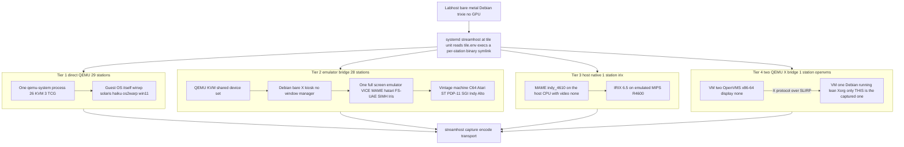

# Guest execution tiers

Kernel Hive is not one architecture repeated 59 times. It is one *daemon*
repeated 59 times, in front of **five structurally different ways of producing
pixels**. Everything downstream of the framebuffer — damage tracking, encode,
transport, client — is identical across tiers. Everything upstream differs, and
that difference is what this page is about.

Companion pages: [`IO-PATHS.md`](IO-PATHS.md) for how input and sound reach each
tier, [`OVERHEAD.md`](OVERHEAD.md) for what each tier costs, and
[`ARCHITECTURE.md`](ARCHITECTURE.md) for the map of the whole system.

## There is no `tier` field

Tier is **derived**, not declared. The registry distinguishes only
`runtime.qemu` vs `runtime.x11` vs an empty runtime, and pushes bridge
membership into a separate file whose header says outright that it is a
migration ledger, not a taxonomy. So the test is:

| Test, in order | Tier |
|---|---|
| `runtime` is empty — no build rows, no launcher, no unit | **5** — showcase poster |
| `runtime.tileEnv.SH_TILE_RUNTIME == "x11"` | **3** — host-native |
| id appears in `registry/bridge-suites.json` `.tiles` | **2** — emulator bridge |
| id is `openvms` | **4** — two-QEMU X bridge |
| otherwise | **1** — direct QEMU |

Applying that to all 61 registry entries gives **29 / 28 / 1 / 1 / 2**.

> **Roster note.** `python3 scripts/stations-registry.py count` prints *61 lineup
> entries: 59 streamhost production stations, 2 showcase posters*. If a doc tells
> you 39/37, it is stale — run the command. The posters today are `riscos` and
> `macos`; `win11` is a live Tier-1 station, not a poster.

## The tiers

| Tier | Count | What actually runs | Capture | Emulation layers between host CPU and the exhibit |
|---|---:|---|---|---|
| **1 — direct QEMU** | 29 | One `qemu-system-*` running the guest OS itself | `qemu` (default) | 1 VM; **0** interpretation layers under KVM, **1** under TCG |
| **2 — emulator bridge** | 28 | Same QEMU/KVM device set, but the guest is a thin overlay on a shared read-only Debian base: autologin → `startx` → **no window manager** → one full-screen emulator | `qemu` (default) — an ordinary Linux framebuffer | **2** (KVM VM + software emulator), +1 managed runtime on `alto`/`star`/`daybreak` |
| **3 — host-native** | 1 | No QEMU, no QMP. MAME `indy_4610` on the bare-metal host CPU with `-video none` | `shm` | **1** (software emulator only, no VM) |
| **4 — two-QEMU X bridge** | 1 | One supervisor owns **two sibling VMs**: a 768 MiB Debian running lean Xorg (captured) and an 8192 MiB OpenVMS VM with `display none` reaching it as an X client | `qemu`, attached to the **bridge** VM | 1 VM for the pixels, produced by a second sibling VM over X |
| **5 — showcase poster** | 2 | Nothing. No runtime, no launcher, no unit | none | 0 |

A sixth mode, `pve` (a Proxmox-managed VM addressed by VMID), is **declared in
the schema but used by no station**.

## Membership

- **Tier 1 (29)** — `alpine android aros freedos haiku helenos kolibrios
  msdoswin1 ninefront nt351 nt4 os2warp postmarketos qnx reactos redstar2
  redstar3 sailfishos serenityos solaris templeos tinycore toaruos win11 win2000
  win311 win95 win98se winxp`
- **Tier 2 (28)** — `alto amiga amstradcpc apple2 armeval atarist bbcmicro c128
  c64 cbm2 cbm8032 daybreak decos dragon32 gt40 indyr4400 kc854 mpf2 nextstep
  oricatmos pdp11 pet2001 plus4 sinclairql star vic20 zx81 zxspectrum`
- **Tier 3 (1)** — `irix` · **Tier 4 (1)** — `openvms` · **Tier 5 (2)** —
  `macos riscos`

## Sub-structure worth knowing

**Tier 1 is not homogeneous.** Three stations are TCG-interpreted rather than
KVM-accelerated — `nt351` (486), `os2warp` (pentium), `win311`
(`qemu-system-i386`, pentium) — so they carry an interpretation layer the other
26 do not. Counting `openvms` as a QEMU station the split is 27 KVM / 3 TCG out of
30; counting it as its own tier, Tier 1 is 26 / 3 out of 29. Both numbers are
correct and they differ only in where `openvms` is filed.

Three stations do **not** run a stock QEMU binary: `solaris` uses the patched build
carrying `gallery-hid-pci`, and `nt351`/`nt4` use separate cirrus-fix builds.
Patches live in `streamhost/qemu-patches/`.

**Tier 2 is mid-migration.** The base is two populations — the frozen Debian 12
bookworm base and the trixie one — because an overlay names its backing file by
*path* and depends on it block-for-block. The current split is the subject of
[`lab/BRIDGE-TRIXIE-MIGRATION.md`](lab/BRIDGE-TRIXIE-MIGRATION.md); ask
`scripts/dev/bridge-suite-status.sh` rather than trusting a number written here.
`c64` is the exception that is neither: its overlay was flattened into a
standalone qcow2 with no backing file, so it reports DETACHED rather than
drifted.

The inner emulators, from the registry build rows: **VICE** (`c64` x64sc, `c128`
x128, `vic20` xvic, `plus4` xplus4, `pet2001` xpet, `cbm8032` xpet -model 8032,
`cbm2` xcbm2), **MAME** (`bbcmicro`/`armeval`, `dragon32`, `oricatmos`, `kc854`,
`sinclairql`, `zx81`, `zxspectrum`, `mpf2`), **Open SIMH** (`pdp11`, `gt40`
VT11, `decos`), **hatari** (`atarist`), **LinApple** (`apple2`), **FS-UAE**
(`amiga`), **cap32** (`amstradcpc`), **Previous** (`nextstep`), **ContrAlto** on
.NET (`alto`), **Darkstar** on mono (`star`), **Dwarf/Draco** on OpenJDK
(`daybreak`), **Iris** — native Rust (`indyr4400`).

**`irix` and `indyr4400` are a deliberate tier-contrast pair**, not a duplicate
exhibit: the same IRIX 6.5 install rendered through two different tiers, with
`indyr4400`'s disk extracted from a copy of `irix`'s seed CHD. Tier 3 exists
because MAME's SGI Indy emulation **kernel-panics under a KVM vCPU** — a
constraint, not a preference. The performance consequence of that pairing is in
[`OVERHEAD.md`](OVERHEAD.md#cpu); the short version is that comparing them
directly flatters MAME, because MAME runs throttled and Iris runs free.

**Every tier is served by the same systemd template and the same binary shape.**
`streamhost@<tile>.service` reads `/data/vms/streamhost/tiles/%i/tile.env` and
execs a per-station versioned binary symlink. The tier is expressed entirely in
`tile.env` plus which launcher was emitted — which is why a tier change is a
config change, not a code change.

**The effective environment is `tileEnv` THEN the appended fixture**, and they
can disagree. `irix` is the live example: the registry declares
`stream.audio: false` (emitting `SH_AUDIO=off`) while the appended fixture sets
`SH_AUDIO=on` with `SH_AUDIO_SOURCE=fifo`. Reading only the registry block for a
station can give you the pre-fixture value.

**Only 5 of 59 stations put their guest in a memory-capped cgroup** — the four
original kiosks `c64 atarist apple2 amiga` and `irix`. Both scopes are
`BindsTo=` their unit, so `systemctl stop` reaches the whole tree; that binding
was added after orphaned watchdogs survived a stop and poisoned a measurement
campaign. Every other launcher is exec'd bare.

## Per-guest table

Generated from `registry/tiles/*.json` and `registry/bridge-suites.json` — the
same files the daemon and the UI read. Regenerate rather than hand-edit.

Pointer methods across the 59 production stations: `qemu-usb-tablet` 24, **none
17**, `qemu-ps2-relative` 8, `warpd-agent` 5, `qemu-vmmouse` 2, and one each of
`gallery-hid`, `simh-light-pen`, `mame-ioport`. Audio on 49 / off 10. Stream
rate 60 fps on 32, 30 fps on 27. Exec channel: `ssh` 31, none 26, one
`warpd_e`, one `serial_e`.

That "none 17" is the single most surprising number here: **more than a quarter
of the lineup has no pointer at all.** Those are the keyboard-only and
switch-only machines — PETs, the KC 85, the single-board trainers — where a
mouse would be an anachronism, not a missing feature.

| Station | Tier | Suite / accel | Pointer method | Mode | Touch | Audio | fps | Exec |
|---|---|---|---|---|---|---|---:|---|
| `alpine` | 1 direct-QEMU | kvm | `qemu-usb-tablet` | abs | — | on | 60 | ssh |
| `alto` | 2 bridge | bookworm | `qemu-usb-tablet` | abs | — | on | 30 | ssh |
| `amiga` | 2 bridge | bookworm | `qemu-usb-tablet` | abs | — | on | 60 | ssh |
| `amstradcpc` | 2 bridge | bookworm | `qemu-ps2-relative` | rel | — | on | 60 | ssh |
| `android` | 1 direct-QEMU | kvm | `qemu-usb-tablet` | abs | yes | on | 30 | — |
| `apple2` | 2 bridge | bookworm | `qemu-usb-tablet` | abs | — | on | 60 | ssh |
| `armeval` | 2 bridge | bookworm | `none` | none | — | on | 60 | ssh |
| `aros` | 1 direct-QEMU | kvm | `qemu-usb-tablet` | abs | — | on | 30 | — |
| `atarist` | 2 bridge | trixie | `qemu-usb-tablet` | abs | — | on | 60 | ssh |
| `bbcmicro` | 2 bridge | bookworm | `none` | none | — | on | 60 | ssh |
| `c128` | 2 bridge | bookworm | `none` | none | — | on | 60 | ssh |
| `c64` | 2 bridge | bookworm | `qemu-ps2-relative` | rel | — | on | 60 | ssh |
| `cbm2` | 2 bridge | bookworm | `none` | none | — | on | 60 | ssh |
| `cbm8032` | 2 bridge | bookworm | `none` | none | — | on | 60 | ssh |
| `daybreak` | 2 bridge | bookworm | `qemu-usb-tablet` | abs | — | off | 60 | ssh |
| `decos` | 2 bridge | bookworm | `none` | none | — | on | 60 | ssh |
| `dragon32` | 2 bridge | bookworm | `none` | none | — | on | 60 | ssh |
| `freedos` | 1 direct-QEMU | kvm | `qemu-ps2-relative` | rel | — | on | 30 | — |
| `gt40` | 2 bridge | trixie | `simh-light-pen` | abs | — | on | 60 | ssh |
| `haiku` | 1 direct-QEMU | kvm | `qemu-usb-tablet` | abs | — | on | 30 | ssh |
| `helenos` | 1 direct-QEMU | kvm | `qemu-usb-tablet` | abs | — | on | 30 | — |
| `indyr4400` | 2 bridge | bookworm | `qemu-ps2-relative` | rel | — | off | 30 | ssh |
| `irix` | 3 host-native | MAME/host | `mame-ioport` | abs | — | off | 30 | serial_e |
| `kc854` | 2 bridge | bookworm | `none` | none | — | on | 60 | ssh |
| `kolibrios` | 1 direct-QEMU | kvm | `qemu-usb-tablet` | abs | — | on | 30 | — |
| `macos` | 5 poster | — | `none` | — | — | off | — | — |
| `mpf2` | 2 bridge | bookworm | `none` | none | — | on | 60 | ssh |
| `msdoswin1` | 1 direct-QEMU | kvm | `qemu-ps2-relative` | rel | — | on | 60 | — |
| `nextstep` | 2 bridge | bookworm | `qemu-usb-tablet` | abs | — | on | 60 | ssh |
| `ninefront` | 1 direct-QEMU | kvm | `warpd-agent` | warpd | — | on | 60 | — |
| `nt351` | 1 direct-QEMU | tcg | `qemu-ps2-relative` | rel | — | on | 30 | — |
| `nt4` | 1 direct-QEMU | kvm | `qemu-vmmouse` | abs | — | off | 30 | — |
| `openvms` | 4 two-QEMU | kvm x2 | `qemu-usb-tablet` | abs | — | off | 30 | — |
| `oricatmos` | 2 bridge | bookworm | `none` | none | — | on | 60 | ssh |
| `os2warp` | 1 direct-QEMU | tcg | `warpd-agent` | warpd | — | on | 30 | — |
| `pdp11` | 2 bridge | trixie | `none` | none | — | on | 60 | ssh |
| `pet2001` | 2 bridge | bookworm | `none` | none | — | on | 60 | ssh |
| `plus4` | 2 bridge | bookworm | `none` | none | — | on | 60 | ssh |
| `postmarketos` | 1 direct-QEMU | kvm | `qemu-usb-tablet` | abs | yes | on | 60 | — |
| `qnx` | 1 direct-QEMU | kvm | `qemu-ps2-relative` | rel | — | on | 30 | — |
| `reactos` | 1 direct-QEMU | kvm | `qemu-usb-tablet` | abs | — | on | 30 | — |
| `redstar2` | 1 direct-QEMU | kvm | `qemu-usb-tablet` | abs | — | off | 30 | none |
| `redstar3` | 1 direct-QEMU | kvm | `qemu-usb-tablet` | abs | — | off | 30 | — |
| `riscos` | 5 poster | — | `none` | — | — | off | — | — |
| `sailfishos` | 1 direct-QEMU | kvm | `qemu-usb-tablet` | abs | yes | off | 30 | — |
| `serenityos` | 1 direct-QEMU | kvm | `qemu-vmmouse` | abs | — | on | 60 | — |
| `sinclairql` | 2 bridge | bookworm | `none` | none | — | on | 60 | ssh |
| `solaris` | 1 direct-QEMU | kvm | `gallery-hid` | abs | — | on | 60 | warpd_e |
| `star` | 2 bridge | bookworm | `qemu-ps2-relative` | rel | — | off | 30 | ssh |
| `templeos` | 1 direct-QEMU | kvm | `warpd-agent` | warpd | — | off | 30 | — |
| `tinycore` | 1 direct-QEMU | kvm | `qemu-usb-tablet` | abs | — | on | 60 | ssh |
| `toaruos` | 1 direct-QEMU | kvm | `qemu-usb-tablet` | abs | — | on | 30 | — |
| `vic20` | 2 bridge | bookworm | `none` | none | — | on | 60 | ssh |
| `win11` | 1 direct-QEMU | kvm | `qemu-usb-tablet` | abs | — | on | 30 | — |
| `win2000` | 1 direct-QEMU | kvm | `qemu-usb-tablet` | abs | — | on | 30 | — |
| `win311` | 1 direct-QEMU | tcg | `warpd-agent` | warpd | — | on | 30 | — |
| `win95` | 1 direct-QEMU | kvm | `warpd-agent` | warpd | — | on | 30 | — |
| `win98se` | 1 direct-QEMU | kvm | `qemu-usb-tablet` | abs | — | on | 30 | — |
| `winxp` | 1 direct-QEMU | kvm | `qemu-usb-tablet` | abs | — | on | 30 | — |
| `zx81` | 2 bridge | bookworm | `none` | none | — | on | 60 | ssh |
| `zxspectrum` | 2 bridge | bookworm | `none` | none | — | on | 60 | ssh |
