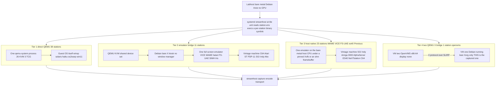

# Guest execution tiers

Kernel Hive is not one architecture repeated 75 times. It is one *daemon*
repeated 75 times, in front of **five structurally different ways of producing
pixels**. Everything downstream of the framebuffer — damage tracking, encode,
transport, client — is identical across tiers. Everything upstream differs, and
that difference is what this page is about.

**Direction of travel.** Tiers are not equal options. The target form for every
station is **direct framebuffer capture + input forwarding** — Tier 1 for
anything QEMU can run, Tier 3 for anything that needs another emulator. Tier 2
(emulator inside a captured Linux kiosk) is a **legacy population under
conversion**, not a design choice: the spike measured host-native at ~69% of the
kiosk's cost, nine MAME stations were converted on that verdict
([`lab/DEBRIDGE-CONVERSION-BRIEF.md`](lab/DEBRIDGE-CONVERSION-BRIEF.md)), and the
rest follow. A new station may pass *through* a trixie kiosk as a
proof-of-concept while its emulator is still being proven, but must not ship in
one.

Companion pages: [`IO-PATHS.md`](IO-PATHS.md) for how input and sound reach each
tier, [`OVERHEAD.md`](OVERHEAD.md) for what each tier costs, and
[`ARCHITECTURE.md`](ARCHITECTURE.md) for the map of the whole system.

## There is no `tier` field

Tier is **derived**, not declared (the derivation below is code in
`scripts/stations_registry/fleet_table.py`, and the UI's `/fleet` table shows
the result per station). The registry distinguishes only
`runtime.qemu` vs `runtime.x11` vs an empty runtime, and pushes bridge
membership into a separate file whose header says outright that it is a
migration ledger, not a taxonomy. So the test is:

| Test, in order | Tier |
|---|---|
| `runtime` is empty — no build rows, no launcher, no unit | **5** — showcase poster |
| `runtime.stationEnv.SH_STATION_RUNTIME == "x11"` | **3** — host-native |
| id appears in `registry/bridge-suites.json` `.tiles` | **2** — emulator bridge |
| id is `openvms` | **4** — two-QEMU X bridge |
| otherwise | **1** — direct QEMU |

Applying that to all 77 registry entries gives **40 / 11 / 23 / 1 / 2**.

> **Roster note.** `python3 scripts/stations-registry.py count` prints *77 lineup
> entries: 75 streamhost production tiles, 2 showcase posters*. If a doc tells
> you 61/59, it is stale — run the command. The posters today are `riscos` and
> `macos`; `win11` is a live Tier-1 station, not a poster.
>
> **Tier 2 is now the minority.** The de-bridging wave
> ([`lab/DEBRIDGE-CONVERSION-BRIEF.md`](lab/DEBRIDGE-CONVERSION-BRIEF.md)) moved
> the MAME and VICE kiosks, `nextstep` and the es40 Alphas to host-native, so
> Tier 3 is the second-largest tier and still growing. Any number in an older
> doc that reads "28 bridges" predates it.

## The tiers

| Tier | Count | What actually runs | Capture | Emulation layers between host CPU and the exhibit |
|---|---:|---|---|---|
| **1 — direct QEMU** | 38 | One `qemu-system-*` running the guest OS itself | `qemu` (default) | 1 VM; **0** interpretation layers under KVM, **1** under TCG |
| **2 — emulator bridge** | 11 | Same QEMU/KVM device set, but the guest is a thin overlay on a shared read-only Debian base: autologin → `startx` → **no window manager** → one full-screen emulator | `qemu` (default) — an ordinary Linux framebuffer | **2** (KVM VM + software emulator), +1 managed runtime on `alto`/`star`/`daybreak` |
| **3 — host-native** | 23 | No QEMU, no QMP. One emulator on the bare-metal host CPU — MAME, VICE, es40, Previous, FS-UAE — either headless or inside a pinned Xvfb sized to its own window | `shm` where the emulator publishes its own framebuffer, `x11` where it needs a window | **1** (software emulator only, no VM) |
| **4 — two-QEMU X bridge** | 1 | One supervisor owns **two sibling VMs**: a 768 MiB Debian running lean Xorg (captured) and an 8192 MiB OpenVMS VM with `display none` reaching it as an X client | `qemu`, attached to the **bridge** VM | 1 VM for the pixels, produced by a second sibling VM over X |
| **5 — showcase poster** | 2 | Nothing. No runtime, no launcher, no unit | none | 0 |

A sixth mode, `pve` (a Proxmox-managed VM addressed by VMID), is **declared in
the schema but used by no station**.

## Membership

- **Tier 1 (40)** — `aix432 alpine android aros aux beos bootos chokanji freedos
  haiku helenos hpuxvue kolibrios macos753 macos9 msdoswin1 ninefront nt351 nt4
  os2warp postmarketos qnx ravynos reactos redstar2 redstar3 rhapsody
  sailfishos serenityos solaris sunos414 templeos tinycore toaruos win11
  win2000 win311 win95 win98se winxp`
- **Tier 2 (11)** — `alto amiga amstradcpc apple2 atarist daybreak decos gt40
  indyr4400 pdp11 star`
- **Tier 3 (23)** — `amigaos35 amix armeval bbcmicro c128 c64 cbm2 cbm8032
  dragon32 irix kc854 mpf2 newsos nextstep oricatmos pet2001 plus4 sinclairql
  tru64 vic20 w2kalpha zx81 zxspectrum`
- **Tier 4 (1)** — `openvms` · **Tier 5 (2)** — `macos riscos`

## Sub-structure worth knowing

**Tier 1 is not homogeneous.** Eleven stations are TCG-interpreted rather than
KVM-accelerated — `aix432 aux beos hpuxvue macos753 macos9 nt351 os2warp
rhapsody sunos414 win311` — so they carry an interpretation layer the other 29
do not. Every foreign-architecture guest is necessarily in that list (PowerPC,
PA-RISC, m68k, SPARC); the rest are x86 guests too old for KVM. Counting
`openvms` as a QEMU station the split is 30 KVM / 11 TCG out of 41; counting it
as its own tier, Tier 1 is 29 / 11 out of 40. Both numbers are correct and they
differ only in where `openvms` is filed.

Three stations do **not** run a stock QEMU binary: `solaris` uses the patched build
carrying `gallery-hid-pci`, and `nt351`/`nt4` use separate cirrus-fix builds.
Patches live in `streamhost/qemu-patches/`.

**Tier 2 is mid-migration.** The base is two populations — the frozen Debian 12
bookworm base and the trixie one — because an overlay names its backing file by
*path* and depends on it block-for-block. The current split is the subject of
[`lab/BRIDGE-TRIXIE-MIGRATION.md`](lab/BRIDGE-TRIXIE-MIGRATION.md); ask
`scripts/dev/bridge-suite-status.sh` rather than trusting a number written here.
`c64` is the exception that is neither: its overlay was flattened into a
standalone qcow2 with no backing file, so it reports DETACHED rather than
drifted.

The inner emulators still inside a kiosk, from the registry build rows: **Open
SIMH** (`pdp11`, `gt40` VT11, `decos`), **Hatari** (`atarist`), **LinApple**
(`apple2`), **FS-UAE** (`amiga` A1200), **Caprice32** (`amstradcpc`),
**ContrAlto 2** on .NET (`alto`), **Darkstar** on mono (`star`), **Dwarf/Draco**
on OpenJDK (`daybreak`), **Iris** — native Rust (`indyr4400`). The three managed
runtimes are why `alto`, `star` and `daybreak` are the hardest left to
de-bridge: converting them means hosting .NET, mono or a JVM on labhost itself.

**Tier 3 is where the emulators went.** Its 23 stations run **MAME** (`irix`
indy_4610, `newsos` nws3260, `bbcmicro`/`armeval` bbcb, `dragon32`, `oricatmos`,
`kc854`, `sinclairql`, `zx81`, `zxspectrum`, `mpf2`), **VICE** (`c64` x64sc,
`c128` x128, `vic20` xvic, `plus4` xplus4, `pet2001` xpet, `cbm8032` xpet -model
8032, `cbm2` xcbm2), **es40** (`tru64`, `w2kalpha`), **Previous** (`nextstep`)
and **FS-UAE 3.2.35** (`amigaos35` A4000/040, `amix` A3000). Capture splits with
the emulator, not with the tier: everything above publishes its own framebuffer
into shared memory (`SH_CAPTURE=shm`) except the two FS-UAE stations, which need
a window and are captured off the root of a pinned Xvfb (`SH_CAPTURE=x11`).

**`irix` and `indyr4400` are a deliberate tier-contrast pair**, not a duplicate
exhibit: the same IRIX 6.5 install rendered through two different tiers, with
`indyr4400`'s disk extracted from a copy of `irix`'s seed CHD. Tier 3 exists
because MAME's SGI Indy emulation **kernel-panics under a KVM vCPU** — a
constraint, not a preference. The performance consequence of that pairing is in
[`OVERHEAD.md`](OVERHEAD.md#cpu); the short version is that comparing them
directly flatters MAME, because MAME runs throttled and Iris runs free.

**Every tier is served by the same systemd template and the same binary shape.**
`streamhost@<tile>.service` reads `/data/vms/streamhost/stations/%i/station.env` and
execs a per-station versioned binary symlink. The tier is expressed entirely in
`station.env` plus which launcher was emitted — which is why a tier change is a
config change, not a code change.

**The effective environment is `stationEnv` THEN the appended fixture**, and they
can disagree. `irix` is the live example: the registry declares
`stream.audio: false` (emitting `SH_AUDIO=off`) while the appended fixture sets
`SH_AUDIO=on` with `SH_AUDIO_SOURCE=fifo`. Reading only the registry block for a
station can give you the pre-fixture value.

**Only 5 of 75 stations put their guest in a memory-capped cgroup** — the four
original kiosks `c64 atarist apple2 amiga` and `irix`. Both scopes are
`BindsTo=` their unit, so `systemctl stop` reaches the whole tree; that binding
was added after orphaned watchdogs survived a stop and poisoned a measurement
campaign. Every other launcher is exec'd bare.

## Per-guest table

Generated from `registry/stations/*.json` and `registry/bridge-suites.json` — the
same files the daemon and the UI read. Regenerate rather than hand-edit.

Pointer methods across the 75 production tiles: `qemu-usb-tablet` 24, **none
19**, `qemu-ps2-relative` 8, `warpd-agent` 5, `mame-ioport` 4,
`qemu-guestram-abswrite` 3, `x11-warp-absolute` 2, `qemu-vmmouse` 2, and one
each of `gallery-hid`, `simh-light-pen`, `qemu-mga-closedloop`,
`qemu-artist-closedloop`, `qemu-usb-hid-relative`, `qemu-adb-relative`,
`x11-xtest`, `previous-tablet`. Audio on 55 / off 20. Stream rate 30 fps on 41,
60 fps on 32, and one each at 50 (`amigaos35`) and 25 (`amix`). Exec channel:
none 47, `ssh` 14, `warpd_e` 5, `telnet_unix_e` 3, and one each of
`serial_shell`, `serial_e`, `serialcsh_e`, `serialcon_e`, `serial_getty`,
`telnet_e`.

That "none 19" is the single most surprising number here: **a quarter of the
lineup has no pointer at all.** Those are the keyboard-only and switch-only
machines — PETs, the KC 85, the single-board trainers, and `bootos`, whose whole
OS reads the BIOS keyboard — where a mouse would be an anachronism, not a
missing feature.

| Station | Tier | Suite / accel | Pointer method | Mode | Touch | Audio | fps | Exec |
|---|---|---|---|---|---|---|---:|---|
| `aix432` | 1 direct-QEMU | tcg | `qemu-mga-closedloop` | abs | — | off | 30 | telnet_unix_e |
| `alpine` | 1 direct-QEMU | kvm | `qemu-usb-tablet` | abs | — | on | 60 | ssh |
| `alto` | 2 bridge | bookworm | `qemu-usb-tablet` | abs | — | on | 30 | ssh |
| `amiga` | 2 bridge | bookworm | `qemu-usb-tablet` | abs | — | on | 60 | ssh |
| `amigaos35` | 3 host-native | FS-UAE/host | `x11-xtest` | abs | — | off | 50 | — |
| `amix` | 3 host-native | FS-UAE/host | `x11-xtest` | abs | — | off | 25 | — |
| `amstradcpc` | 2 bridge | bookworm | `qemu-ps2-relative` | rel | — | on | 60 | ssh |
| `android` | 1 direct-QEMU | kvm | `qemu-usb-tablet` | abs | yes | on | 30 | — |
| `apple2` | 2 bridge | bookworm | `qemu-usb-tablet` | abs | — | on | 60 | ssh |
| `armeval` | 3 host-native | MAME/host | `none` | none | — | on | 60 | — |
| `aros` | 1 direct-QEMU | kvm | `qemu-usb-tablet` | abs | — | on | 30 | — |
| `atarist` | 2 bridge | trixie | `qemu-usb-tablet` | abs | — | on | 60 | ssh |
| `aux` | 1 direct-QEMU | tcg | `qemu-adb-relative` | rel | — | on | 30 | — |
| `bbcmicro` | 3 host-native | MAME/host | `none` | none | — | on | 60 | — |
| `beos` | 1 direct-QEMU | tcg | `qemu-ps2-relative` | rel | — | off | 30 | telnet_unix_e |
| `bootos` | 1 direct-QEMU | kvm | `none` | none | — | on | 30 | — |
| `c128` | 3 host-native | VICE/host | `none` | none | — | on | 60 | — |
| `c64` | 3 host-native | VICE/host | `none` | none | — | on | 60 | — |
| `cbm2` | 3 host-native | VICE/host | `none` | none | — | on | 60 | — |
| `cbm8032` | 3 host-native | VICE/host | `none` | none | — | on | 60 | — |
| `chokanji` | 1 direct-QEMU | kvm | `qemu-ps2-relative` | rel | — | off | 30 | — |
| `daybreak` | 2 bridge | bookworm | `qemu-usb-tablet` | abs | — | off | 60 | ssh |
| `decos` | 2 bridge | trixie | `none` | none | — | on | 60 | ssh |
| `dragon32` | 3 host-native | MAME/host | `none` | none | — | on | 60 | — |
| `freedos` | 1 direct-QEMU | kvm | `qemu-ps2-relative` | rel | — | on | 30 | — |
| `gt40` | 2 bridge | trixie | `simh-light-pen` | abs | — | on | 60 | ssh |
| `haiku` | 1 direct-QEMU | kvm | `qemu-usb-tablet` | abs | — | on | 30 | ssh |
| `helenos` | 1 direct-QEMU | kvm | `qemu-usb-tablet` | abs | — | on | 30 | — |
| `hpuxvue` | 1 direct-QEMU | tcg | `qemu-ps2-relative` | rel | — | off | 30 | — |
| `indyr4400` | 2 bridge | bookworm | `qemu-ps2-relative` | rel | — | off | 30 | ssh |
| `irix` | 3 host-native | MAME/host | `mame-ioport` | abs | — | on | 30 | serial_e |
| `kc854` | 3 host-native | MAME/host | `none` | none | — | on | 60 | — |
| `kolibrios` | 1 direct-QEMU | kvm | `qemu-usb-tablet` | abs | — | on | 30 | — |
| `macos` | 5 poster | — | `none` | — | — | off | — | — |
| `macos753` | 1 direct-QEMU | tcg | `qemu-adb-relative` | rel | — | on | 30 | — |
| `macos9` | 1 direct-QEMU | tcg | `qemu-usb-hid-relative` | rel | — | off | 30 | — |
| `mpf2` | 3 host-native | MAME/host | `none` | none | — | on | 60 | — |
| `msdoswin1` | 1 direct-QEMU | kvm | `qemu-ps2-relative` | rel | — | on | 60 | — |
| `newsos` | 3 host-native | MAME/host | `mame-ioport` | abs | — | off | 30 | serialcsh_e |
| `nextstep` | 3 host-native | Previous/host | `previous-tablet` | abs | — | on | 60 | — |
| `ninefront` | 1 direct-QEMU | kvm | `warpd-agent` | warpd | — | on | 60 | — |
| `nt351` | 1 direct-QEMU | tcg | `qemu-ps2-relative` | abs | — | on | 30 | — |
| `nt4` | 1 direct-QEMU | kvm | `qemu-vmmouse` | abs | — | off | 30 | warpd_e |
| `openvms` | 4 two-QEMU | kvm x2 | `qemu-usb-tablet` | abs | — | off | 30 | — |
| `oricatmos` | 3 host-native | MAME/host | `none` | none | — | on | 60 | — |
| `os2warp` | 1 direct-QEMU | tcg | `warpd-agent` | warpd | — | on | 30 | — |
| `pcgeos` | 1 direct-QEMU | kvm | `qemu-guestram-abswrite` | abs | ramabs | on | 30 | — |
| `pdp11` | 2 bridge | trixie | `none` | none | — | on | 60 | ssh |
| `pet2001` | 3 host-native | VICE/host | `none` | none | — | on | 60 | — |
| `plus4` | 3 host-native | VICE/host | `none` | none | — | on | 60 | — |
| `postmarketos` | 1 direct-QEMU | kvm | `qemu-usb-tablet` | abs | yes | on | 60 | — |
| `qnx` | 1 direct-QEMU | kvm | `qemu-ps2-relative` | rel | — | on | 30 | — |
| `ravynos` | 1 direct-QEMU | kvm | `qemu-usb-tablet` | abs | — | on | 30 | — |
| `reactos` | 1 direct-QEMU | kvm | `qemu-usb-tablet` | abs | — | on | 30 | — |
| `redstar2` | 1 direct-QEMU | kvm | `qemu-usb-tablet` | abs | — | off | 30 | none |
| `redstar3` | 1 direct-QEMU | kvm | `qemu-usb-tablet` | abs | — | off | 30 | — |
| `rhapsody` | 1 direct-QEMU | tcg | `qemu-ps2-relative` | rel | — | off | 30 | serial_getty |
| `riscos` | 5 poster | — | `none` | — | — | off | — | — |
| `sailfishos` | 1 direct-QEMU | kvm | `qemu-usb-tablet` | abs | yes | off | 30 | — |
| `serenityos` | 1 direct-QEMU | kvm | `qemu-vmmouse` | abs | — | on | 60 | — |
| `sinclairql` | 3 host-native | MAME/host | `none` | none | — | on | 60 | — |
| `solaris` | 1 direct-QEMU | kvm | `gallery-hid` | abs | — | on | 60 | warpd_e |
| `star` | 2 bridge | bookworm | `qemu-ps2-relative` | rel | — | off | 30 | ssh |
| `sunos414` | 1 direct-QEMU | tcg | `qemu-ps2-relative` | rel | — | on | 30 | telnet_unix_e |
| `templeos` | 1 direct-QEMU | kvm | `warpd-agent` | warpd | — | off | 30 | — |
| `tinycore` | 1 direct-QEMU | kvm | `qemu-usb-tablet` | abs | — | on | 60 | ssh |
| `toaruos` | 1 direct-QEMU | kvm | `qemu-usb-tablet` | abs | — | on | 30 | — |
| `tru64` | 3 host-native | es40/host | `mame-ioport` | abs | — | off | 30 | serialcon_e |
| `ubuntu` | 1 direct-QEMU | kvm | `qemu-usb-tablet` | abs | — | off | 30 | — |
| `vic20` | 3 host-native | VICE/host | `none` | none | — | on | 60 | — |
| `w2kalpha` | 3 host-native | es40/host | `mame-ioport` | abs | — | off | 30 | telnet_e |
| `win11` | 1 direct-QEMU | kvm | `qemu-usb-tablet` | abs | — | on | 30 | — |
| `win2000` | 1 direct-QEMU | kvm | `qemu-usb-tablet` | abs | — | on | 30 | warpd_e |
| `win311` | 1 direct-QEMU | tcg | `warpd-agent` | warpd | — | on | 30 | — |
| `win95` | 1 direct-QEMU | kvm | `warpd-agent` | warpd | — | on | 30 | warpd_e |
| `win98se` | 1 direct-QEMU | kvm | `qemu-usb-tablet` | abs | — | on | 30 | warpd_e |
| `winxp` | 1 direct-QEMU | kvm | `qemu-usb-tablet` | abs | — | on | 30 | — |
| `zx81` | 3 host-native | MAME/host | `none` | none | — | on | 60 | — |
| `zxspectrum` | 3 host-native | MAME/host | `none` | none | — | on | 60 | — |
