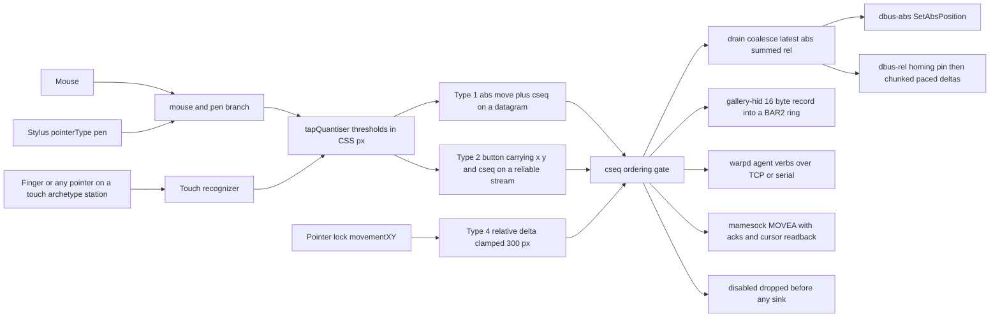
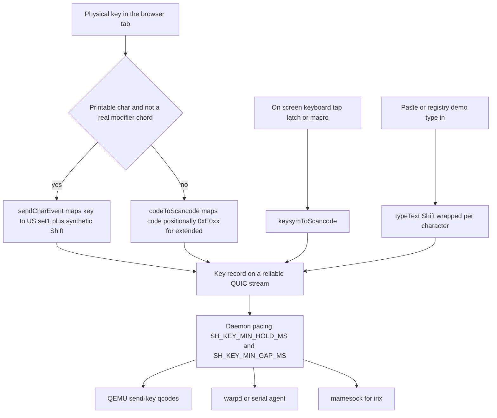
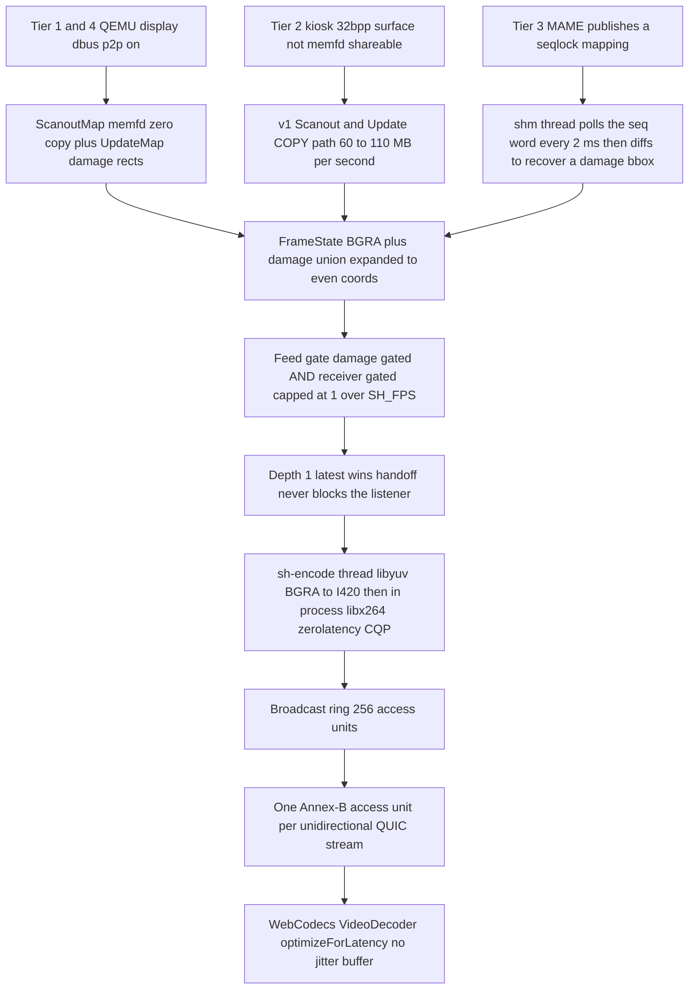
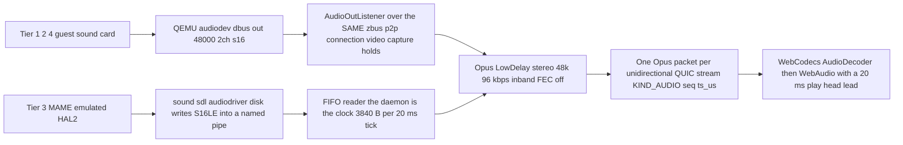

# I/O paths — pointer, keyboard, video, sound

What each tier does with a mouse move, a keypress, a frame and a sound. The
tiers themselves are in [`GUEST-TIERS.md`](GUEST-TIERS.md); the cost of each
path is in [`OVERHEAD.md`](OVERHEAD.md).

The organising fact: **video and audio converge, input diverges.** Every tier
funnels pixels into one capture→encode→transport path and sound into one Opus
encoder, but a pointer event can end up in any of eight different sinks. That
asymmetry is why almost every "it feels wrong" report is an input report.

---

## 1. Pointer

One browser wire format, eight server-side sinks.

**The client is authoritative.** It emits absolute guest-pixel records: a type-1
move `(u16 x, u16 y, u32 cseq)` and a type-2 button
`(u8 button, u8 down, u16 x, u16 y, u32 cseq)`. The button **carries its own
coordinates**, so the network cannot separate a press from its position, and
`cseq` lets the daemon discard an absolute move older than one already applied
rather than rewind the cursor under a held button. Buttons are never dropped as
stale — a lost click is worse than a backwards cursor. Relative moves carry no
`cseq` at all, because deltas accumulate.

`pointer_mode` is **derived, not chosen**: it is a projection of the backend,
and `stations-registry.py` re-derives it and *fails the build* on disagreement. The
declared method is pinned against the emulated device ledger — `qemu-usb-tablet`
requires `usb-tablet` in the launcher, `qemu-ps2-relative` forbids it,
`gallery-hid` requires `gallery-hid-pci`.

Backend census across the 59 production stations: **dbus-abs 27, disabled 17,
dbus-rel 8, warpd 5, gallery-hid 1, mamesock 3** (`irix`, `w2kalpha`, `tru64`).

| Path | Used by | Abs/rel | Mechanism | Trade-off |
|---|---|---|---|---|
| **dbus-abs / usb-tablet** | 24 stations — `winxp win2000 reactos haiku alpine tinycore nextstep openvms` and every graphical kiosk | abs | type-1 → per-session drain-coalesce → `Mouse.SetAbsPosition` after the cursor-scale affine | Simplest and truest; needs the guest to bind a usb-tablet |
| **dbus-abs / vmmouse** | `nt4` (explicit), `serenityos` (implicit q35 `vmport=auto`) | abs | same call; the absolute device is QEMU's VMware aux mouse | Avoids a USB stack; the implicit case is invisible in the device ledger |
| **dbus-rel / homing bridge** | `nt351 freedos msdoswin1 qnx indyr4400 star c64 amstradcpc` | rel (client still sends abs) | first sample pins the cursor to 0,0 with an over-clamp, waits, then sends deltas from the last target | Works on any PS/2-only guest with no device change; guest acceleration and out-of-band cursor moves desync the model |
| **dbus-rel / quantized bridge** | `aux` (macos753 is the plain calibrated form) | rel (client still sends abs) | same bridge, plus `SH_REL_MAX_STEP` (chunk cap, 32) and `SH_REL_QUANTUM` (send only multiples of N units, 4; remainder pending in the model) | Exact when the guest's per-event response is a deterministic truncation below a threshold (A/UX "Very Slow": px = trunc(0.75·units) up to 32 units, accelerated above): every send lands on the model, residual < one quantum, no drift; still open-loop — no cursor readback |
| **dbus-rel / re-home + paced bridge** | `macos753` (canary; the rest by measurement) | rel (client still sends abs) | same bridge with the model tracking what was SENT and pending motion re-aimed at the newest target; `SH_REL_HOME_ON=reset,resume,focus,idle,edge` re-runs the corner pin when the guest cursor moved behind the model's back (loadvm via SIGUSR2 from `reset-tile.sh`, idle-pause resume, the SPA's type-7 hint on tab-visible/focus/pointer-enter, N s idle, or a target on a screen edge = an over-clamp on that axis); `SH_REL_PACED=1` sends ONE bounded step (`SH_REL_MAX_STEP`) per pace tick (`SH_REL_STEP_PACE_MS`) across all samples so nothing outruns the guest's PS/2/ADB accumulator | Removes the visitor's manual corner chase and the drift of fast sweeps / Cmd-Tab returns; still open-loop, ceiling = the guest link × px/count. `streamhost/streamhost/src/rel_bridge.rs`, plan + rollout in [`lab/research/rel-pointer-rehome-and-rate-cap.md`](lab/research/rel-pointer-rehome-and-rate-cap.md) |
| **type-4 direct relative** (Pointer Lock) | `freedos qnx msdoswin1 indyr4400 star` | rel | locked `movementX/Y`, clamped 300 px/axis, straight to `rel_motion_bounded` — no homing pin | True 1:1 with the guest drawing its own cursor; needs fullscreen + a user gesture |
| **gallery-hid** | `solaris` only | abs | guest px normalised to 0..32767 into a 16-byte record over a unix chardev; QEMU publishes into a 256-entry BAR2 ring and raises INTA | Fastest and most faithful in the fleet; costs a patched QEMU **and** a custom guest driver per OS |
| **warpd agent** (pure) | `ninefront templeos`, `solaris` (rollback + `E` exec) | abs | newline `M/P/R/B` verbs over TCP hostfwd or a serial chardev; the agent calls XTEST / the Plan 9 absolute mouse / writes `ms.pos` | Reaches full-screen absolute where the tablet is capped or absent; protocol is **frozen** |
| **warpd HYBRID** | `win311 os2warp win95` | abs motion + PS/2 buttons | motion via the agent, buttons via the real QEMU device so the WM sees true button semantics | The only way to open a menu or drag a title bar on Win3.11; **every reposition re-arms the button hold** |
| **mamesock** (closed loop) | `irix` | abs | surface-clamped `MOVEA x y` over the in-emulator ctlsock with per-verb acks; the module reads the real cursor from Newport VC2 hardware-cursor registers each tick and converges | Immune to dead-reckoning drift and edge clamping; costs a patched MAME and a single-injector rule |
| **mamesock** (open loop) | `tru64`, `w2kalpha` | abs | same verb into es40's ctlsock, but there is no cursor readback: the emulator corner-homes once, then believes its own arithmetic. Exactness therefore depends on the guest moving **1 px per injected count** — flat X acceleration, and `ES40_POINTER_GAIN` where it does not (Tru64 moves 2 px/count) | No patched cursor readback needed, but any guest-side acceleration or gain silently doubles every move; measure before declaring `reset.mouse` PASS |
| **simh-light-pen** | `gt40` | abs | ordinary dbus-abs through a usb-tablet; SIMH's VT11 vector display reads the position as the GT40's light pen | The method label is the only record of the light-pen semantics |
| **disabled** | 17 kiosks — `armeval bbcmicro c128 cbm2 cbm8032 decos dragon32 kc854 mpf2 oricatmos pdp11 pet2001 plus4 sinclairql vic20 zx81 zxspectrum` | none | every non-type-3 record is dropped before any sink | Cannot strand a button or drift a cursor — **unpointable by design**, not broken |

### Rules you will otherwise re-derive

- **The homing pin is 2048, not 8192.** The PS/2 wire carries at most ~127
  counts per packet at 100 Hz, so an 8192 pin is ~65 packets and nearly a
  second — and anything sent during the drain queues behind it and merges into
  one enormous negative motion.
- **All relative sends are chunked and paced**, because QEMU's PS/2 emulation
  accumulates and clamps a single large motion. Measured on QNX: a lone −8192 is
  a no-op, and −1024 moves only ~500 px.
- **Button edges take a blocking lock; moves take `try_lock`.** Dropping a move
  is free; dropping an edge loses the click or strands a button down. Measured
  on IRIX, a ~25/s hover stream beat every press to the lock and every press was
  silently discarded.
- **Three client paths, and the visitor's hardware does not choose.** A mouse
  *and a stylus* take the mouse/pen branch; only a finger — or any pointer on a
  touchscreen-archetype station — reaches the touch recognizer. Two fixes were once
  shipped to the recognizer and changed nothing, because the pen never ran that
  code. `touchExhibit` means *the exhibit* is a touchscreen; `isTouchDevice()`
  means *the visitor's* hardware. One letter apart, opposite in effect.
- **An open-loop absolute pointer is only as true as the guest's gain.** es40's
  ctlsock homes the cursor to (0,0) once and then dead-reckons, so a guest that
  moves two pixels per injected PS/2 count lands every target at twice the
  delta and ends up clamped in a corner — which looks exactly like "the pointer
  is broken", not like "the pointer is scaled". Measure it from inside the
  guest (Tru64: `xptr`, an XQueryPointer one-liner in `/usr/local/bin`) before
  believing any pointer claim, and set `ES40_POINTER_GAIN` to the measured
  pixels-per-count. On a gain-2 guest the reachable positions are an even
  lattice, so odd targets land 1 px short.
- **QMP `abs`/`click` does nothing on a warpd station.** The guest has no working
  absolute pointer — that is why it runs an agent. Do not use QMP to "check"
  pointer behaviour there.

### Kiosks add a second mapping

The outer contract is absolute: browser guest-px → `SetAbsPosition` → usb-tablet
→ kiosk Xorg → full-screen emulator. The **inner** emulator then adds its own
mapping, which must pass its own framebuffer gate. Class A emulators follow the
host cursor 1:1 (FS-UAE); Class B are relative-only inside and need edge
re-homing plus a measured cursor scale. `c64` is the documented exception: VICE
consumes *relative* host motion, so its launcher sets `vmport=off`, keeps `-usb`
but omits `usb-tablet`, and declares `rel` — without `vmport=off`, QEMU's
implicit VMware absolute mouse becomes the active handler and silently absorbs
the relative events.

---

## 2. Keyboard

| Path | Used by | Mechanism | Pacing required | Failure mode when wrong |
|---|---|---|---|---|
| **QMP/dbus send-key** | most QEMU stations | qcode injection; types uppercase and symbols correctly where the browser path mangles them | `SH_KEY_MIN_HOLD_MS` / `SH_KEY_MIN_GAP_MS` | Characters vanish or arrive scrambled |
| **warpd / serial agent** | `win311 os2warp templeos ninefront win95` | agent verbs over TCP hostfwd or serial chardev | agent-side pace | Modifier batched into one event is not seen as a chord |
| **mamesock** | `irix`, `w2kalpha`, `tru64` | paced verbs with per-verb acks into the emulator | ack deadline | — |
| **kiosk X → emulator** | kiosks | key reaches the kiosk's Xorg, then the full-screen emulator's own input sampling | **per-machine**, frame-derived | Dropped keys that look like flaky typing |

**The pacing rule is the whole story, and it is not about speed.** An emulator
samples its key matrix once per emulated **frame**, so what must survive is the
**release→press gap**, not the keystroke rate. Measured:

| Machine | Bisect | Shipped |
|---|---|---|
| `mpf2` (MAME, 60 Hz), 16-key line | gap 0 ms → **0 of 16** keys land; 8 ms → 4; 12 ms → 12; **16 ms (one frame) → 16 of 16** | 32/32 (two frames) |
| `alto` (ContrAlto), 20-char line | 16/16 → 15 of 20; 33/33, 66/66, 120/120 → **20 of 20** | 66/66 (two 33 ms Alto fields) |
| `vic20` | 40/40 still corrupted 1 line in 22; 60/60 and 80/80 corrupted none | 80/80 |
| `pdp11` (SIMH behind a pty) | a 69-char line at **0 ms** gap echoed intact 5 of 5 — **no key matrix to scan** | 40/40 for the PS/2→X→xterm hops |

`pdp11` is the control that proves the mechanism: a serial-line machine has no
matrix to sample, so it has no gap requirement at all. The residual `vic20`
failure is **host scheduling on labhost running 30+ emulators**, not frame
quantisation — it does not scale with the frame period.

> `labctl type` bypasses this pacing and drops characters **while printing
> "ok"**. It is not a fair test of whether a station's keyboard works.

---

## 3. Video

Every tier converges after the framebuffer. Only the front differs.

| Tier | Capture mechanism | Notable cost |
|---|---|---|
| **1, 4 — QEMU** | dbus-display `ScanoutMap` **memfd zero-copy** + `UpdateMap` damage rects | The cheap path |
| **2 — bridge** | Same dbus capture, but a 32bpp guest-VRAM surface is **not memfd-shareable**, forcing QEMU's flow-control-free **v1 copy path** | 60–110 MB/s of `Update` calls, bounded by `SH_QEMU_RSS_GUARD_MB`; plus a Linux compose term |
| **3 — shm** | MAME publishes frames itself into a seqlock-protected file mapping; the host diffs to recover damage | No QEMU, so **no RSS guard** on this tier |
| **5 — poster** | none | — |

Downstream is identical everywhere: damage-gated **and receiver-gated** capture
(an unwatched station encodes nothing), a depth-1 latest-wins handoff that never
blocks the capture listener, one `sh-encode` OS thread holding the x264 handle,
constant-quality CQP with no VBV, one access unit per unidirectional QUIC
stream, and a forced keyframe on join so a new viewer never waits for the next
GOP.

The x11/XDamage backend still exists in the code but **no production station
selects it** since the shm cutover; it is retained deliberately as the `irix`
rollback.

---

## 4. Sound

Guest audio reaches the browser as **48 kHz stereo Opus, 20 ms per packet**
(50 packets/s), on one encode path fed by two possible PCM sources. There is
**no PulseAudio or PipeWire on labhost at all**.

| Source | Used by | Guest sound device | Mechanism |
|---|---|---|---|
| **`dbus`** (default) | 48 production stations | AC97 ×36, sb16 ×6, intel-hda ×5, ich9-intel-hda ×1 (`win11`), PC-speaker only ×1 (`msdoswin1`) | streamhost exports an `AudioOutListener` over the **same p2p connection the video capture already holds** |
| **`fifo`** | `irix` only | emulated SGI HAL2 inside MAME | MAME writes PCM into a named pipe; **the daemon is the clock**, reading exactly 3840 B per 20 ms with the pipe shrunk to 16 KiB |

Audio state across the fleet: **49 stations on, 10 off, 2 posters undeclared.**
`sb16` exists for exactly the six DOS/Win9x stations that ship no inbox AC97 or HDA
driver. `star` and `daybreak` keep a sound card with audio **off** purely for
`loadvm golden` device-set parity — the emulated Xerox machines have no sound
hardware at all.

Three things that are easy to get wrong:

- **Audio is not part of the ABR ladder or the backlog governor.** Only video is
  rate-adapted. A lagging session's audio task skips the gap rather than
  dropping the session.
- **The wire format is fixed, not negotiated** — 48 kHz stereo Opus, hardcoded
  on the client, with no per-stream preamble and no length prefix. A previous
  client that assumed a preamble misread `seq` as the sample rate and silenced
  audio on every station.
- **On `shm`/`x11` stations the dbus source cannot work**, because there is no QEMU
  p2p connection to borrow. It logs `audio: DISABLED … SH_AUDIO_SOURCE=fifo is
  the non-QEMU path` rather than silently running video-only.

`irix` carries a known, accepted defect: the PROM chime and default-rate 4Dwm
sounds play, but the first client that *reprograms* the HAL2 output rate emits
one ~0.07 s blip and then kills the output clock for the whole session. It is a
MAME hal2 emulation defect and is cleared only by reset.
