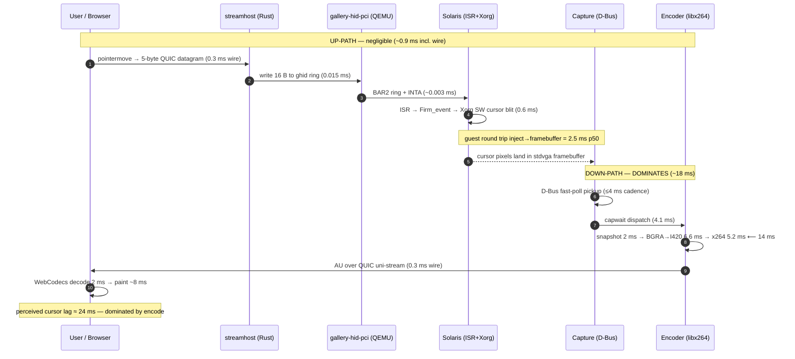

# Solaris gallery-hid cursor latency profile (end-to-end)

**Station:** `solariscde` — Solaris CDE, `SH_INPUT_BACKEND=gallery` (gallery-hid-pci HW
input), 1920×1200, tier-0 CQP q10 (veryfast/high/zerolatency), `SH_FPS=60`,
`SH_DBUS_UPDATE_MS=4`, keyframe 2500 ms.
**Question profiled:** *perceived* mouse-cursor latency = the FULL round trip a user
feels — up-path (event → server → gallery-hid → Solaris) + guest render (Xorg cursor)
+ down-path (capture → H.264 encode → transport → decode → paint).

> **Headline:** perceived cursor latency is **encode-bound, not input-bound.** The
> gallery-hid HW input path (up-path) is ~**0.015 ms** of real work and the whole guest
> round trip is ~**2.5 ms**; both are dwarfed by the **down-path full-frame capture +
> H.264 encode (~18 ms)**. The single largest slice is the H.264 encode hop at
> **14 ms p50**, inside which **BGRA→I420 conversion (6.6 ms)** and **x264 wall
> (5.2 ms)** dominate — every tiny cursor move pays a *full 1920×1200* re-convert +
> re-encode.

Measurements are from a **namespaced clone** (`/data/vms/sandbox/latprobe`, VMID 199,
2 vCPUs via `sockets=2` + `hv-vendor-id=XenVMMXenVMM`, reflink copy of a paused
checkpoint — **the live `solariscde` station was never touched**), plus live-UI transport
probes from CT950 and the reused stage-d D-Bus ROI harness. labhost was **quiesced**
(only live solariscde + CT950), so x264 wall time is near its floor — see
[Caveats](#caveats).

---

## 1. End-to-end breakdown

### The 12 hops

| # | Hop | Path | p50 (ms) | p95 (ms) | Source |
|---|-----|------|---------:|---------:|--------|
| 1–2 | Browser capture pointermove + pack 5-byte record | up | 0.2 | 0.5 | *est. (code)* |
| 3 | UP transport browser→server (QUIC **datagram**, ~5 B) | up | **0.3** | **0.7** | *measured (RTT/2)* |
| 4 | streamhost receive + route/coalesce | up | 0.1 | 0.3 | *est. (code)* |
| 4→5 | streamhost → gallery-hid ring write | up | **0.015** | **0.025** | *measured (in-daemon)* |
| 5 | gallery-hid-pci: BAR2 ring publish + INTA | up | ~0.003 | — | *est. (code)* |
| 6 | Solaris `ghid_intr` ISR → VUID Firm_event → Xorg | up | <0.05 | — | *est. (code)* |
| 7 | Xorg **software** cursor render (misprite blit) | guest | **~0.6** | ~0.75 | *measured (by diff)* |
| 5→8 | **guest round trip** (device+ISR+Xorg+capture pickup) | — | **2.5** | **4.4** | *measured (in-daemon)* |
| 7→8 | frame-cadence gate (D-Bus 4 ms poll) | — | 1.96 | 4.01 | *measured (stage-d)* |
| 8→enc | capwait (dispatch: poll + 48 fps rate-cap, continuous drag) | down | **4.1** | **7.8** | *measured (in-daemon)* |
| 9 | **H.264 encode** (full 1920×1200) | down | **14.0** | **17.9** | *measured (in-daemon)* |
| 9→10 | publish AU to broadcast | down | 0.013 | 0.018 | *measured (in-daemon)* |
| 10 | DOWN transport server→browser (QUIC uni-stream) | down | **0.3** | **0.7** | *measured (RTT/2)* |
| 11 | WebCodecs decode | down | 2.0 | ~4 | *measured (SW, CT950)* |
| 12 | Browser paint / present | down | ~8 | ~16 | *est. (SW-inflated UB)* |

**Encode hop-9 component split** (p50 / p95, µs): snapshot 2054 / 2556 · scene-detect
236 / 431 · queue 16 / 23 · **conv (BGRA→I420) 6558 / 9216** · **x264 5197 / 5950
wall** (only ~2.4 ms of that is CPU — the rest is scheduler wall-inflation).

**Server-side one-way total** hop4→hop10 (continuous interaction): **p50 ≈ 20.6 ms**
(0.015 + 2.5 + 4.1 + 14.0 + 0.013). Real-user full round trip (with HW decode/GPU
client) is estimated **~24 ms p50 / ~48 ms p95**; the one glass-to-glass number we
could measure (32 ms p50) is a non-representative upper bound from CT950's SW WebGL /
SW-decode path.

### Sequence diagram

### Flame / waterfall — where the milliseconds go

Each bar is a hop, laid on a shared timeline so the dominant contributors are visually
obvious. **Blue-ish = up/guest (input path); the long tail = down/video path.**

```mermaid
gantt
    title Solaris gallery-hid cursor round trip — p50 timeline (ms). Input path = first 2.9 ms; everything after is the VIDEO down-path.
    dateFormat  X
    axisFormat  %s ms
    section UP + GUEST (input path ≈ 2.9 ms)
    UP transport (datagram) 0.3ms      :done, a1, 0, 1
    streamhost→ghid ring 0.015ms       :done, a2, 1, 1
    gallery-hid + Solaris ISR <0.05ms  :done, a3, 2, 1
    Xorg SW cursor render 0.6ms        :done, a4, 3, 1
    section CAPTURE cadence
    D-Bus capwait 4.1ms                :active, b1, 4, 4
    section ENCODE (dominant, 14 ms)
    snapshot copy 2ms                  :crit, c1, 8, 2
    BGRA to I420 conv 6.6ms            :crit, c2, 10, 7
    x264 encode wall 5.2ms             :crit, c3, 17, 5
    section DOWN + CLIENT
    DOWN transport 0.3ms               :done, d1, 22, 1
    WebCodecs decode 2ms               :d2, 23, 2
    Browser paint ~8ms (SW est)        :d3, 25, 8
```

*(Gantt bars are laid end-to-end for visual weight; in reality some client-side stages
overlap the next frame. The relative widths are what matter: the three red ENCODE bars
are ~14 ms — larger than the entire input path + transport + guest combined.)*

### Input path vs video path — which dominates?

| Path | Sum of its hops (p50) | Share of ~24 ms round trip |
|------|----------------------:|---------------------------:|
| **Input / up-path** (hops 1–6: browser→wire→streamhost→device→ISR) | **~0.5 ms** | ~2% |
| **Transport** (hop 3 + hop 10 combined RTT) | **0.6 ms** | <3% |
| Guest render (hop 7 Xorg cursor) | ~0.6 ms | ~3% |
| **Video / down-path** (capture cadence + **encode** + decode + paint) | **~28 ms of the serial chain**, ~18 ms server-side | **>85%** |

**Verdict: the video down-path dominates, and within it the H.264 encode (and its
full-frame BGRA→I420 conversion) is the single largest contributor.** The gallery-hid
HW input work this project shipped is *correct and fast* but is **not** where perceived
latency lives.

---

## 2. Hot-path audit (avoidable work)

### Down-path (the part that matters)

- **Full-frame re-encode on every tick.** `snapshot_bgra()`
  (`streamhost/streamhost/src/capture.rs:108`) copies the whole ~9.2 MB framebuffer and
  the encoder converts + encodes all 2.3 MP even for a 1-cursor-block move. Damage
  rectangles carried by D-Bus `Update`/`UpdateMap` bump only the generation counter —
  they are **never** used to scope the encoded region (no ROI/slice encode). This is the
  root cause of the 6.6 ms conversion + 5.2 ms x264 cost. *(INPUT-LATENCY.md lever E,
  not built.)*
- **BGRA→I420 conversion is the biggest single component** (6.6 ms p50), larger than
  x264 itself. `bgra_to_i420()` `streamhost/streamhost/src/encode/worker.rs:147` is
  already AVX2 but runs over the full frame every time.
- **capwait (~4 ms)** — the encode feed is gated behind the D-Bus poll cadence + the
  48 fps rate-cap even for an isolated cursor move; decoupling the feed would shave a
  few ms under sustained interaction.

### Solaris ISR (`galleryhid.c`) — correct & event-driven, but carries diagnostic fat

The ISR is cleanly interrupt-driven (no polling, correct shared-INTx UNCLAIMED
fast-path, race-free producer-recheck drain). Avoidable work found, ranked:

1. **Per-record `cmn_err(CE_NOTE)` inside the ISR** — `ghid_log_record()`
   (`streamhost/guest-agents/solaris-galleryhid/galleryhid.c:883`, emits at
   **:913 / :921 / :927**) writes a console/message-buffer line for **every** pointer
   record, in interrupt context, with no runtime off-switch. Stage-d flags this as the
   likely **loaded-tail** confound (loaded p99 30–37 ms). *Idle impact is negligible;
   fix before trusting any loaded number.*
2. **Redundant MMIO doorbells (real VM exits — BAR0 is `memory_region_init_io`).**
   Per-drain `GUEST_KICK` write (`:1079`) + `IRQ_ACK` (`:1080`), and the tail `IRQ_ACK`
   (`:1088`) writes `~GHID_IRQ_RING` — for a pure pointer IRQ that acks nothing yet still
   costs an exit. `GUEST_KICK` is only needed to un-stage a backpressured record
   (ring-full, rare); in the common case it is a redundant exit.
3. **16× `ddi_get8` per record** (`:776` helper, per-record loop) instead of a bulk/wide
   read.
4. **`allocb()` per event** (`:229` / `:286` / `:335`) instead of the preallocated mblk
   pool the design spec called for → allocation variance in the hot path.
5. **Guest re-validates every record** the QEMU device already validated before
   publishing.
6. **No coalescing of adjacent pure-motion records** — a burst drains N records as N
   allocb/putnext cycles though only the latest position matters to Xorg.

### QEMU device (`gallery-hid-pci.c`) — essentially free (~2–5 µs)

- Minor: `gallery_publish()` does **two** 16-byte memcpys per event
  (`streamhost/qemu-patches/gallery-hid/gallery-hid-pci.c:187` then `:191`) only to
  stamp the sequence; could copy host_record→slot once and `stw` the seq directly.
  Sub-microsecond — cosmetic.

### Architectural note (not a bug)

Xorg uses `Driver "vesa"` on `-vga std`, so there is **no hardware cursor plane** — the
mi **software** cursor redraws into the captured framebuffer on every move (empirically
confirmed: the screendump contains the cursor). This is **required**: a HW cursor plane
would make the cursor invisible to the D-Bus/screendump capture and it would vanish from
the browser stream. The cost — a per-move guest cursor redraw plus 2 damage rects
(old+new bbox) to capture/encode — is the price of a visible cursor, not a defect.

---

## 3. Ranked latency-reduction ideas

Merged + deduped across the input-path, video-path, transport, and guest angles. Sorted
by **expected saving ÷ effort** (best ratio first). "Saving" is the perceived-latency
reduction for a cursor move; hardware column notes EUR + 1U fit.

| Idea | Targets (hops) | Expected saving | Effort | Risk | Hardware (EUR, 1U?) | Notes |
|------|----------------|-----------------|--------|------|---------------------|-------|
| **Verify SPS VUI `num_reorder_frames=0` / `max_dec_frame_buffering≤1`** | 11 decode | **up to ~16 ms** *if* a hidden DPB frame exists (0 if already set) | **trivial** | low | €0 | Cheapest possible check; a browser DPB defensively buffering 1 frame would silently add ~16 ms. INPUT-LATENCY.md lever D. Do this first. |
| **Client-side cursor prediction** | whole RTT (perceived) | hides ~24 ms *for the cursor* | low–med | low (client-only, no pipeline change) | €0 | Draw the cursor locally at the pointer; guest catches up underneath. Doesn't reduce actual pipeline latency but eliminates *perceived* cursor lag. INPUT-LATENCY.md lever A. |
| **Region/damage-scoped conv + encode (ROI)** | 8–9 | ~10–11 ms (kills full-frame conv 6.6 ms + most of x264 5.2 ms for cursor-only frames) | high (re-arch) | medium | €0 | Use the damage rects already delivered by D-Bus to convert+encode only the changed region. Attacks the actual dominant cost. INPUT-LATENCY.md lever E. |
| **Faster BGRA→I420 (libyuv / wider SIMD / fewer passes)** | 9 conv | ~2–5 ms | medium | low | €0 | 6.6 ms conv is the single biggest encode component and is pure host CPU. |
| **Lower encode resolution (e.g. 1280×800)** | 8–9 | ~8–10 ms (conv+encode scale ~2.4×) | low | med (sharpness) | €0 | Cheap lever if CDE at 1280×800 is acceptable; halves the pixel work. |
| **Decouple encode feed from 48 fps rate-cap / widen isolated-event bypass** | 8→enc | ~2–4 ms (capwait) | low | low | €0 | Under sustained drag the cap adds up to a frame interval; isolated moves already bypass it. |
| **preset=ultrafast (from veryfast)** | 9 x264 | ~3 ms | trivial | med (bitrate/quality) | €0 | x264 CPU already ~2.4 ms; ultrafast trims analysis at a quality/bitrate cost. |
| **GPU / hardware H.264 encode (NVENC/QSV/VA-API)** | 9 | ~12–13 ms (14 ms → ~1–2 ms) | high | med | **~€1000–1500 pro card (NVIDIA A2 / RTX A2000, single-slot low-profile) — fits 1U; consumer cards ~€150–300 but capped NVENC sessions** | Biggest hardware lever; needs a session-unlimited pro card because 28 stations share. Pair with ROI for max effect. INPUT-LATENCY.md lever B. |
| **Remove per-record `cmn_err` in Solaris ISR** | 6 | loaded-tail only (idle ~0) | low | low | €0 | galleryhid.c:913/921/927. Fixes loaded p99, not idle perceived latency. Prerequisite for trustworthy loaded numbers. |
| **Drop redundant `GUEST_KICK` + zero-value tail `IRQ_ACK`** | 6 | ~2–3 VM exits/event (µs) | low | low | €0 | galleryhid.c:1079/1088. Idle-negligible; matters only under heavy input rate. |
| **Bulk-read record / preallocate mblk pool** | 6 | µs + tail smoothing | low | low | €0 | galleryhid.c:776 loop, allocb sites. Nice-to-have. |
| **`SH_DBUS_UPDATE_MS=2` (from 4)** | 8 | ~1 ms capture | trivial | med (can encode-starve a busy guest) | €0 | Diminishing returns; CAPTURE-FASTPOLL.md warns N=2 risks starvation. |
| **10 GbE NIC (enables raw/less-compressed ROI headroom)** | 9–10 | enables the ROI-raw path below | med | low | **~€50–150 SFP+ NIC, low-profile — fits 1U** | Only useful *with* a raw/ROI down-path; full-frame raw still needs 4.4 Gbps (see Q&D). |

### Recommended first 3

1. **Verify the SPS VUI `num_reorder_frames`/`max_dec_frame_buffering`** — trivial, and
   if a hidden decoder-buffered frame exists it is a free ~16 ms.
2. **Client-side cursor prediction** — client-only, zero pipeline risk, and it hides the
   *entire* round trip for the thing the user actually watches (the cursor).
3. **Region/damage-scoped conv + encode (ROI)** — the real structural fix; it directly
   attacks the dominant 14 ms encode by not re-processing 2.3 MP for a cursor blob.
   (GPU encode is the hardware alternative if ROI proves too invasive.)

---

## 4. Direct answers to the questions

### (a) Binary mouse encoding in the browser — worth it?

**Already done, and it is not the bottleneck — no further gain.** Mouse moves are
already packed as a **5-byte little-endian binary record** (`sendMoveAbs`
`spa/src/three/streamClient.ts:1306`) sent on an unreliable QUIC datagram. The entire
up-transport is **0.3 ms p50** (half of a measured 0.6 ms datagram RTT), i.e. **<3% of
the round trip**. There is no text/JSON encoding to remove and no measurable latency to
reclaim here. **Verdict: not worth any effort — it's already binary and already
negligible.**

### (b) Are we using UDP everywhere we can?

**Yes — the reliable/unreliable split is reference-optimal (matches Moonlight/Sunshine)
and is confirmed by both code and tcpdump.**

- **Supersedable input** (mouse move type1/4, RTT ping type9, ABR stats) → **unreliable,
  unordered QUIC datagrams** (UDP, no retransmit, no HOL). Correct: a stale move is
  worthless, so never retransmit it.
- **Discrete input** (buttons/keys/wheel) → **reliable per-class QUIC uni-streams**.
  Correct and *required*: a dropped keyup = stuck key. Per-class so one class's
  retransmit can't head-of-line-block another.
- **Video AUs** → **reliable QUIC uni-streams** (one AU per stream). Deliberately
  reliable: an AU exceeds one MTU, so datagrams would need app-level fragmentation + FEC
  to replace what per-frame QUIC streams give for free; on a clean LAN there is zero
  retransmit so reliable == datagram latency, and per-frame streams already avoid
  cross-frame HOL. This is a **measured ~5–6× LAN win over WebRTC** (whose jitter buffer
  can't be floored on our bursty damage-gated source).

**Verdict: yes. UDP/datagrams are used everywhere a packet is supersedable; reliable
QUIC is used only where correctness demands it, and even that rides UDP. Nothing uses a
reliable stream where an unreliable datagram would be lower-latency.**

### (c) Is it all encoding latency?

**Largely yes on the server side, but not literally all.** The H.264 **encode hop is
14 ms of the ~20.6 ms server-side one-way total**, and capture+encode together (~18 ms)
dwarf the entire input path (2.5 ms) and transport (0.6 ms). Within encode, the
full-frame **BGRA→I420 conversion (6.6 ms)** actually edges out **x264 itself (5.2 ms
wall)**. The remaining perceived-latency terms are the **capture/frame cadence (~4–8 ms
wait for the next poll/emit)** and **client decode + paint (~2 ms + ~8 ms, the latter
SW-inflated on our test box)**. **Verdict: encode (plus its full-frame conversion) is
the single dominant contributor; frame cadence and client paint are secondary; input
and transport are negligible. The perceived-latency problem is a *video-encode* problem,
not an input problem.**

### (d) Raw/uncompressed codec on LAN instead of H.264 — viable?

**Full-frame raw: NOT viable on 1 GbE. Raw/lightly-compressed *damage-region tiles*:
viable and attractive — and it's the same ROI lever.**

- A raw 1920×1200×4 frame is **~9.2 MB**. At 60 fps that is **~4.4 Gbps**, ~4× over
  gigabit; even a single drag frame is ~9.2 MB = **~74 ms serialization** on 1 GbE. So
  full-frame raw *increases* latency and saturates the link. Not viable.
- But raw of just the **cursor damage ROI** (e.g. a 64×64 BGRA tile ≈ 16 KB) trivially
  fits, and **eliminates the 14 ms encode + the ~2 ms decode entirely**. That is exactly
  the region-scoped path (lever E) — the win comes from *not sending the whole frame*,
  whether the tile is raw or lightly compressed (QOI/PNG/JPEG per rect).
- A **10 GbE NIC** (~€50–150, low-profile, fits 1U) would give raw headroom
  (9.2 MB×60 ≈ 4.4 Gbps fits 10 GbE), but the **host-side full-frame CPU copy + the
  browser having no raw-BGRA fast path** remain, so 10 GbE alone is not the answer.

**Verdict: don't send raw full frames on 1 GbE (needs 4.4 Gbps). Sending raw or
lightly-compressed *damage-region tiles* IS viable and would remove the encode
bottleneck — pursue it as the ROI lever, not as a wholesale codec swap.**

### Hardware verdict (one line)

The bottleneck is host CPU full-frame H.264 encode; a **single-slot low-profile pro
NVENC card (NVIDIA A2 / RTX A2000, ~€1000–1500, fits 1U, session-unlimited for all 28
stations)** would cut the dominant 14 ms encode to ~1–2 ms and is the top hardware lever —
but the **€0 software ROI/damage-scoped encode** attacks the same cost first and should
be tried before spending money.

---

## Caveats

- **labhost was quiesced** (only live solariscde + CT950). x264 wall time is near its floor;
  under full 28-station fleet load `config.rs` documents x264 p95 inflating to ~96 ms from
  EEVDF scheduler queuing — that would dominate the tail. **Re-measure under load before
  acting on absolute encode numbers.**
- `hop8→encode-start` (capwait) is regime-dependent — reported for continuous drag;
  collapses toward the 2 ms poll under isolated interaction.
- `hop5→8` (isolated) and `hop8→enc` (continuous) are consecutive non-overlapping
  stages, so the p50 sum is valid; **p95s are independent tails and are NOT additive.**
- IDR keyframes (every 2.5 s) spike encode to ~90 ms max — periodic, not per-frame.
- The one glass-to-glass number (32 ms p50 / 165 ms p95) is a **non-representative upper
  bound** — CT950 is GPU-less (SW WebGL + SW H.264 decode + VNC), inflating paint. A
  real user with HW decode + a GPU would see the ~24 ms estimate.
- Solaris 2-vCPU-under-KVM requires `sockets=2` + `hv-vendor-id=XenVMMXenVMM`
  (confirmed `query-cpus-fast=2` on the clone), else only 1 vCPU onlines and numbers are
  wrong.

## Provenance

- **Server-side in-daemon spans** (hop4→5, hop8→enc, encode hop9, publish hop10): direct
  monotonic timestamps on the real production code path, thousands of samples, on the
  2-vCPU `latprobe` clone. Instrumentation was clone-only / unmerged
  (`streamhost/streamhost/src/{clock.rs,capture.rs,realtime_input.rs,encode/*}`).
- **Guest round trip** (hop5→8): stage-d D-Bus ROI harness, N=500, inject→cursor-in-ROI.
- **Transport**: live UI type-9 datagram RTT (Ctrl+N overlay) + tcpdump on labhost;
  live solariscde observed **read-only** (no injection/savevm/restart).
- **Prior docs reused:** `docs/INPUT-LATENCY.md`,
  `docs/lab/research/low-latency-input/{measurement-and-host.md,spike-solaris-runbook.md}`,
  `streamhost/docs/{CAPTURE-FASTPOLL.md,CONFIG.md}` and (archived)
  `docs/history/ENCODER-INPROCESS-FINDINGS.md`.
- Clone + build targets + pcaps torn down after measurement; live `solariscde`
  (pid verified alive) untouched throughout.
